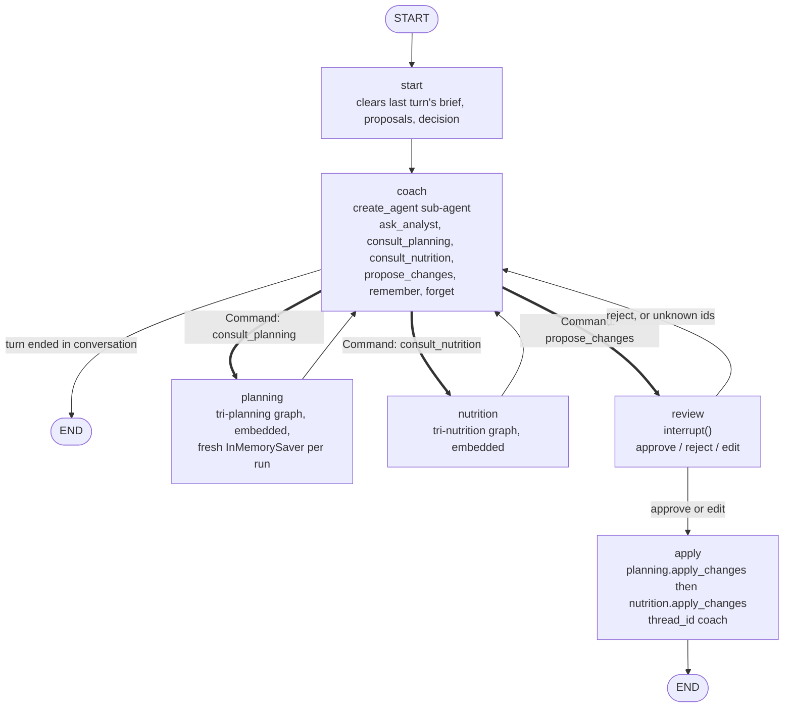

# tri-coach Plan 2 of 3: Coach v1 Implementation Plan

> **For agentic workers:** REQUIRED SUB-SKILL: Use superpowers:subagent-driven-development (recommended) or superpowers:executing-plans to implement this plan task-by-task. Steps use checkbox (`- [ ]`) syntax for tracking.

**Goal:** Create the `tri-coach` package: the agent the athlete talks to. It answers questions through the analyst (agent-as-tool), decides on its own authority when a plan or nutrition change is warranted, briefs the planning and nutrition graphs (handoffs, run embedded and stateless), presents one change set at a single review gate, and dispatches the approved changes through each package's `apply_changes`. Coach-owned athlete memory lives in the LangGraph Store. Commands: `tri-coach chat`, `tri-coach memory`, `tri-coach reset`. This is spec milestone 2; the check-in command, the post-apply nutrition regeneration gate and the routing evaluation are milestone 3.

**Architecture:** One `StateGraph` on thread `coach`. `START -> start -> coach`; `coach -> END` by a static edge. `coach` is a node function wrapping a `create_agent` sub-agent whose system prompt is rendered per turn (stable rules, then a context block from the database and both Store namespaces, then memory). Three of its tools return `Command(goto=..., graph=Command.PARENT)`: `consult_planning` and `consult_nutrition` land a `Brief` in state and jump to the `planning` or `nutrition` node, which runs the package graph in embedded mode with a private `InMemorySaver` (so every consultation is fresh), maps the output to a `Proposal`, and writes the result back as the content of the handoff's own `ToolMessage` (same message id, so the history reads as one tool call and its result). `propose_changes` jumps to `review`, which builds the `ChangeSet` from the proposal ids, pauses with `interrupt`, and on approve routes to `apply`, which calls planning's then nutrition's `apply_changes` with `thread_id="coach"`. `ask_analyst` runs the analyst agent on a throwaway thread and returns its text. `remember`/`forget` edit the Store under `("athlete", "coach")`.

**Tech Stack:** langgraph 1.2.11 (`Command.PARENT`, `InjectedState`, `InjectedToolCallId`, `interrupt`, `AsyncPostgresSaver`, `AsyncPostgresStore`), langchain 1.4.0 `create_agent`, langchain-anthropic 1.7.1, pydantic 2, typer, rich, PyYAML, pytest with `tri_core.testing.ScriptedChatModel` and the rolled-back `db` fixture.

**Spec:** `docs/superpowers/specs/2026-09-11-tri-coach-design.md` (§1 decisions, §3 overview, §4 layout, §5 data model, §6 graph, §7.3 sessions, §8 commands, §9 errors, §10 configuration, §11 testing, §13 milestone 2, §15 open items). Plan 1 (`docs/superpowers/plans/2026-09-12-tri-coach-01-sub-package-preparation.md`) is merged at `2853f2f` and delivered everything this plan consumes.

## Global Constraints

- Python `>=3.12,<3.13`, uv-managed; every command runs from the worktree root as `uv run ...`.
- New package: distribution `tri-coach`, module `tri_coach`, console script `tri-coach`. It depends on `tri-core`, `tri-analyze`, `tri-planning`, `tri-nutrition`. No existing package gains a dependency; no new third-party dependencies (spec §10). Root `pyproject.toml` adds `tri-coach` to `[project] dependencies`, `[tool.uv.sources]`, ruff `known-first-party`, and mypy `files`.
- Settings (spec §10): `TRI_COACH_LANGSMITH_PROJECT` (default `tri_coach`), `TRI_COACH_MAX_CONSULTS_PER_DOMAIN` (default `2`). `.env.example` gains both.
- Invariants (spec §6.3), preserved by construction: no write tool is ever bound to a model; the only path into either package's `apply_changes` is the coach's `apply` node, reached only from `review` on approve or edit; the embedded sub-graphs contain no `review` or `apply`; the coach never edits a change payload (the athlete may, at review); nothing is written to Garmin or TrainingPeaks before the athlete approves.
- Authority (spec §1): sub-agents never initiate a change under the coach; every brief names the signal, the lever and the constraint; at most `TRI_COACH_MAX_CONSULTS_PER_DOMAIN` consultations per domain per turn, enforced by the prompt, with `recursion_limit` on the run as the hard stop.
- Memory: namespace `("athlete", "coach")`, key `memory`, value `{"entries": [...]}`; `reset --forget-memory` deletes that key and nothing else; the coach never writes nutrition's namespace.
- Standalone CLIs are untouched.
- Brian runs any SQL with `psql`; this plan has no migration (the checkpoint and Store tables exist). Tests write only through the rolled-back `db` fixture; the one Postgres-checkpointer test uses a unique thread id and deletes it.
- `LANGSMITH_TRACING=false` is set in `.env` (tenant over its monthly trace limit); tests must not depend on tracing.
- Git commits are permitted (Brian's standing permission). Commit per task on the feature branch; end every commit message with:
  ```
  Co-Authored-By: Claude Fable 5.1 <noreply@anthropic.com>
  Claude-Session: https://claude.ai/code/session_01QEeNWmAHTuWBXqvsmWi4q2
  ```
- **Execute in a sibling worktree:** `git worktree add ../triathlon_agent-coach-02 -b feat/tri-coach-02 main`, copy `.env`, `uv sync` there. Other Claude sessions share the main checkout.
- Definition of done per task, in order: `uv run ruff format packages/tri-coach`, `uv run pytest -q`, `uv run ruff check .`, `uv run ruff format --check .`, `uv run mypy`. The only acceptable pytest warning is the pre-existing langsmith `ast.Str` DeprecationWarning.
- No "LangChain lesson:" framing in docstrings (Brian's standing feedback).
- Every markdown file created or edited under this project is also copied to `/Users/brian/Documents/dev-vault/projects/paradigm/fitness_agents/triathlon_agent/<same relative path>` with a kebab-case file name.

### Verified before this plan was written (scratch probes, LangGraph 1.2.11)

Scripts under `/private/tmp/claude-501/-Users-brian-Development-paradigm-fitness-agents-triathlon-agent/712aac2b-5db6-49f4-b17f-85f00c7a07e9/scratchpad/langgraph-probes/` (`q1_handoff.py` to `q7_return_direct.py`); the plan's graph tests reproduce the same facts, so the scripts are reference only.

1. **A `Command(graph=Command.PARENT)` from a tool inside `create_agent` (compiled with `checkpointer=False`) reaches the outer graph** whether the agent is invoked from a node function or added as a node (spec §15 item 1: settled). **But the `AIMessage` that carried the tool call is lost**: the `ParentCommand` unwinds the agent before its model step is committed, so only the `Command`'s `update` lands. A `ToolMessage` with no preceding tool use is rejected by Anthropic on the next call. **Fix, verified over two turns (q6):** the handoff tool takes `messages: Annotated[list[AnyMessage], InjectedState("messages")]` and re-emits the turn's messages (everything after the last `HumanMessage`, ids intact) plus its own `ToolMessage` in `update["messages"]`; `add_messages` upserts by id, so nothing duplicates and the next model call sees `Human, AI(tool_calls), Tool, Human`.
2. **A conditional edge on the same node fires alongside the `Command` (q2)**: with `coach -> review when pending` and a handoff in the same turn, both `planning` and `review` ran. So `coach` has only a static edge to `END`, and every non-END transition out of `coach` is a `Command` from a tool. `propose_changes` therefore jumps to `review` itself instead of setting a flag for an edge (deviation from spec §6.3 wording, same behaviour).
3. **A sub-graph compiled with its own `InMemorySaver` and invoked from a node function with the node's config gets a fresh `checkpoint_ns` (`planning:<uuid>`) every superstep** and sees only what the parent passes in; `checkpointer=True` would inherit the parent's thread and remember across turns (spec §15 item 2: settled; q3).
4. **Stream namespaces (q4)**: `()` for the coach graph's own nodes; `("coach:<uuid>",)` for the coach sub-agent's `model`/`tools` steps; `("planning:<uuid>",)` for the embedded planning graph's nodes; `("planning:<uuid>", "adjust:<uuid>")` for its sub-agent. The REPL labels by the first segment's name before the colon (spec §15 item 3: settled).
5. **`interrupt` in the outer `review` node after a `Command` handoff pauses and resumes correctly (q5).**
6. `return_direct=True` on a tool stops `create_agent`'s loop after that tool (q7); kept as the documented fallback only.

### Spec deviations decided in this plan

- **Handoff tools re-emit the turn's messages** (fact 1). `tools/handoff.py` owns `turn_messages(messages)`.
- **Sub-graph results replace the handoff's `ToolMessage`.** Spec §6.2 says the planning/nutrition node "appends a short `AIMessage` naming the proposal id and summary". An `AIMessage` as the last message before the next model call is a prefill for Anthropic, and two assistant messages in a row change meaning. Instead the `Brief` carries the handoff `ToolMessage`'s id and tool call id, and the node emits a `ToolMessage` with the same id whose content is the rendered proposal; `add_messages` replaces it. The history then reads as one tool call and its result, which is what it is.
- **`propose_changes` routes with `Command(goto="review")`** and lands a `ProposalRequest(narration, ids)`; the `review` node resolves ids against `proposals`, builds `pending`, and pauses. Unknown or empty ids return to the coach with a `HumanMessage` beginning `[review]` instead of pausing (spec §9's "the prompt requires the coach to state violations" is unaffected).
- **A `start` node clears per-turn keys** (`brief`, `proposals`, `proposal_request`, `review_decision`, `reports`) because a node whose tool raises `ParentCommand` never returns, so the coach node cannot clear them itself. `pending` is not cleared at `start`: after a partial apply the remainder stays there (spec §6.3) and the context block shows it so the coach can re-propose.
- **Consultation graphs are compiled with a private `InMemorySaver`** (fact 3), not the Postgres checkpointer the spec's §6.3 wording implies; consultation state is never persisted and never shared between turns.
- **`Proposal.overrides`** (nutrition only) carries the sub-graph's `profile_overrides` so `apply_changes(..., overrides=...)` persists a profile change the check-in sub-agent proposed; the spec's `Proposal` had no field for it.
- **Bought-plan adoption.** After a planning apply reports `tp_plan_applied`, the `apply` node invokes the planning graph once more with `{"tp_plan_applied": True}` and no message, which routes `route -> targets -> _adopt_tp_plan` and records ownership (Plan 1's final review found this gap).
- **Weight and body-fat trend.** No series exists in the database (only `athlete_profile.weight_kg`). The context block shows the nutrition profile's goal and weight; the trend is available through `ask_analyst`, whose tool set gains nutrition's `read_body_composition` (over the coach's Garmin session) in addition to the analyst's own live tools.
- **TrainingPeaks binding.** `open_live_servers` binds the union of every package's TrainingPeaks tool names (read and write) so the two `ToolsCaller`s can find them; the analyst is handed only `tri_analyze.allowlist.TP_LIVE_TOOLS` and planning's adjust only what `make_tp_read_tools` builds. No write tool reaches a model.
- **Milestone 3 items are out of scope here:** the check-in checklist in the prompt, the `checkin` memory kind's writer, `Brief.regenerate` handling, `apply -> nutrition` regeneration, `tri-coach check-in`, the routing dataset and `eval`. `MemoryEntry.kind` already admits `"checkin"` and `Brief.regenerate` exists so Plan 3 changes no models.
- **`GraphPhase` from `derive_phase` is the coach's notion of phase** (a plan row with nothing on the calendar is still `planning`), matching Plan 1's ruling.

---

## File Structure

```
packages/tri-coach/
  pyproject.toml
  README.md
  src/tri_coach/
    __init__.py
    config.py                 CoachSettings, get_coach_settings
    allowlist.py              GARMIN_TOOLS, TP_TOOLS (unions), ANALYST_GARMIN_TOOLS, ANALYST_TP_TOOLS
    models.py                 Domain, Brief, Proposal, ProposalRequest, ChangeSet, ReviewDecision,
                              ApplyReport
    memory.py                 NAMESPACE, KEY, MemoryEntry, get_entries, put_entries, add_entry,
                              forget_entry, active, render
    context.py                CoachContext, load_context, render_context
    servers.py                Servers, open_servers
    cli.py                    chat, memory, reset
    repl.py                   TurnPrinter, run_turn, render_review, parse_decision,
                              proposals_to_yaml, proposals_from_yaml, chat_loop
    graph/
      __init__.py
      state.py                CoachState
      deps.py                 CoachDeps, make_deps
      llm.py                  make_model, make_subagent
      checkpointer.py         STATE_TYPES, make_serde, open_checkpointer, checkpointer_ready, SETUP_HINT
      graph.py                start_node, after_review, build_graph
      nodes/
        __init__.py
        coach.py              make_coach_node
        planning.py           make_planning_node, proposal_from_planning
        nutrition.py          make_nutrition_node, proposal_from_nutrition
        review.py             review_node
        apply.py              make_apply_node, report_from_planning, report_from_nutrition
    tools/
      __init__.py
      analyst.py              make_analyst_tool
      handoff.py              turn_messages, make_handoff_tools
      memory.py               make_memory_tools
    prompts/
      __init__.py
      coach.py                PROMPT_VERSION, COACH_RULES, render_system_prompt
    testing.py                scripted deps builders shared by the graph tests
  tests/
    conftest.py
    test_config.py, test_models.py, test_memory.py, test_context.py, test_prompt.py,
    test_servers.py, test_tools.py, test_graph.py, test_graph_apply.py, test_resume.py,
    test_repl.py, test_cli.py, test_live.py
```

Responsibilities: `models.py` is the vocabulary every module shares. `tools/` never touch the database or servers except `ask_analyst`, which owns the analyst run. `graph/nodes/planning.py` and `nutrition.py` are the only callers of the embedded graphs; `graph/nodes/apply.py` is the only caller of either `apply_changes`. `context.py` and `memory.py` are the only readers of the tables and the Store outside the tools. `repl.py` and `cli.py` contain no coaching logic.

---

### Task 1: Package scaffold, settings, models, allow-lists, checkpointer

**Files:**
- Create: `packages/tri-coach/pyproject.toml`, `packages/tri-coach/README.md` (stub: one paragraph, filled in Task 9), `packages/tri-coach/src/tri_coach/__init__.py`, `config.py`, `allowlist.py`, `models.py`, `graph/__init__.py`, `graph/state.py`, `graph/llm.py`, `graph/checkpointer.py`, `graph/nodes/__init__.py`, `tools/__init__.py`, `prompts/__init__.py`, `cli.py` (callback only)
- Modify: root `pyproject.toml`, `.env.example`
- Test: `packages/tri-coach/tests/test_config.py`, `test_models.py`

**Interfaces:**
- Consumes: `tri_core.config.Settings`; `tri_planning.planning.models.CalendarChange`, `PlannedSession`; `tri_nutrition.nutrition.models.NutritionChange`; `tri_analyze.allowlist.GARMIN_LIVE_TOOLS`, `TP_LIVE_TOOLS`; `tri_planning.allowlist.GARMIN_LIVE_TOOLS`, `TP_READ_TOOLS`, `TP_WRITE_TOOLS`; `tri_nutrition.allowlist.GARMIN_SERVER_TOOLS`, `TP_READ_TOOLS`, `TP_WRITE_TOOLS`.
- Produces: `CoachSettings` (`tri_coach_langsmith_project: str = "tri_coach"`, `tri_coach_max_consults_per_domain: int = 2`), `get_coach_settings()`; `Domain = Literal["planning", "nutrition"]`; `Brief(domain, instruction, tool_call_id, message_id, regenerate=False)`; `Proposal(id, domain, summary, changes, violations, question, overrides)` with `render() -> str`; `ProposalRequest(narration, ids)`; `ChangeSet(narration, proposals)`; `ReviewDecision(action, note, proposals)`; `ApplyReport(domain, applied, skipped, remaining, error, sessions_changed)` with `line() -> str`; `CoachState`; `make_model`, `make_subagent`; `STATE_TYPES`, `make_serde`, `open_checkpointer`, `checkpointer_ready`, `SETUP_HINT`; allow-list constants.

- [ ] **Step 1: Worktree**

```bash
cd /Users/brian/Development/paradigm/fitness_agents/triathlon_agent
git worktree add ../triathlon_agent-coach-02 -b feat/tri-coach-02 main
cp .env ../triathlon_agent-coach-02/.env
cd ../triathlon_agent-coach-02 && uv sync && uv run pytest -q 2>&1 | tail -1
```
Expected: `652 passed, 4 skipped, 1 warning`. Every later step runs in `../triathlon_agent-coach-02`.

- [ ] **Step 2: Write the failing tests**

`packages/tri-coach/tests/test_config.py`:
```python
from tri_coach.config import CoachSettings


def test_defaults(monkeypatch):
    monkeypatch.delenv("TRI_COACH_LANGSMITH_PROJECT", raising=False)
    monkeypatch.delenv("TRI_COACH_MAX_CONSULTS_PER_DOMAIN", raising=False)
    s = CoachSettings(_env_file=None)
    assert s.tri_coach_langsmith_project == "tri_coach"
    assert s.tri_coach_max_consults_per_domain == 2
    assert s.database_url.endswith("/tri_analyze")  # inherited from tri_core Settings


def test_env_override(monkeypatch):
    monkeypatch.setenv("TRI_COACH_LANGSMITH_PROJECT", "coach-dev")
    monkeypatch.setenv("TRI_COACH_MAX_CONSULTS_PER_DOMAIN", "3")
    s = CoachSettings(_env_file=None)
    assert s.tri_coach_langsmith_project == "coach-dev"
    assert s.tri_coach_max_consults_per_domain == 3
```

`packages/tri-coach/tests/test_models.py`:
```python
from datetime import date

import pytest
from langgraph.checkpoint.serde.jsonplus import JsonPlusSerializer

from tri_coach.allowlist import ANALYST_GARMIN_TOOLS, ANALYST_TP_TOOLS, GARMIN_TOOLS, TP_TOOLS
from tri_coach.graph.checkpointer import make_serde
from tri_coach.models import ApplyReport, Brief, ChangeSet, Proposal, ReviewDecision
from tri_nutrition.nutrition.models import NutritionChange
from tri_planning.planning.models import CalendarChange


def planning_change():
    return {"op": "delete", "tp_workout_id": "w1", "reason": "knee pain"}


def nutrition_change():
    return {
        "op": "set_day_targets",
        "target_key": "2026-09-14",
        "day": "2026-09-14",
        "payload": {"calorie_goal": 2800},
        "reason": "extend horizon",
    }


def test_proposal_types_changes_by_domain():
    p = Proposal.model_validate(
        {"id": "p1", "domain": "planning", "summary": "drop", "changes": [planning_change()]}
    )
    assert isinstance(p.changes[0], CalendarChange) and p.question is None
    n = Proposal.model_validate(
        {"id": "p2", "domain": "nutrition", "summary": "targets", "changes": [nutrition_change()]}
    )
    assert isinstance(n.changes[0], NutritionChange) and n.overrides is None
    with pytest.raises(ValueError):
        Proposal.model_validate(
            {"id": "p3", "domain": "planning", "summary": "x", "changes": [nutrition_change()]}
        )


def test_proposal_render_names_id_domain_and_outcome():
    p = Proposal.model_validate(
        {
            "id": "p1",
            "domain": "planning",
            "summary": "drop tempo",
            "changes": [planning_change()],
            "violations": ["week over target by 12%"],
        }
    )
    text = p.render()
    assert text.startswith("p1 (planning): drop tempo") and "1 change" in text
    assert "violations: week over target by 12%" in text
    q = Proposal(id="p2", domain="nutrition", summary="", question="Which race day?")
    assert q.render() == "p2 (nutrition) asked instead of proposing: Which race day?"


def test_change_set_and_decision_round_trip():
    p = Proposal.model_validate(
        {"id": "p1", "domain": "planning", "summary": "s", "changes": [planning_change()]}
    )
    cs = ChangeSet(narration="Knee pain: drop Wednesday.", proposals=[p])
    d = ReviewDecision(action="edit", proposals=cs.proposals)
    again = ReviewDecision.model_validate(d.model_dump(mode="json"))
    assert again.proposals is not None and again.proposals[0].changes[0].op == "delete"
    assert ReviewDecision.model_validate({"action": "approve"}).note is None


def test_apply_report_line():
    r = ApplyReport(
        domain="planning", applied=2, skipped=["w9: not agent-authored"], remaining=1,
        error="tp_update_workout failed: boom", sessions_changed=True,
    )
    assert r.line() == (
        "planning: applied 2, skipped 1, 1 still pending; stopped: tp_update_workout failed: boom"
    )
    clean = ApplyReport(
        domain="nutrition", applied=1, skipped=[], remaining=0, error=None, sessions_changed=False
    )
    assert clean.line() == "nutrition: applied 1"


def test_brief_defaults():
    b = Brief(domain="planning", instruction="Drop w1.", tool_call_id="c1", message_id="m1")
    assert b.regenerate is False


def test_allowlists_are_unions_without_duplicates():
    assert GARMIN_TOOLS == sorted(set(GARMIN_TOOLS))
    assert {"get_training_readiness", "get_hrv_data", "get_body_composition",
            "set_nutrition_daily_settings", "get_activity_splits"} <= set(GARMIN_TOOLS)
    assert {"tp_get_workout", "tp_get_workouts", "tp_create_workout", "tp_set_workout_note",
            "tp_apply_training_plan"} <= set(TP_TOOLS)
    assert ANALYST_GARMIN_TOOLS == ["get_activity", "get_activity_splits",
                                    "get_training_readiness", "get_hrv_data"]
    assert ANALYST_TP_TOOLS == ["tp_get_workout"]
    assert not any(n.startswith(("set_", "tp_create", "tp_update", "tp_delete", "tp_apply"))
                   for n in ANALYST_GARMIN_TOOLS + ANALYST_TP_TOOLS)


def test_serde_round_trips_state_types():
    serde = make_serde()
    assert isinstance(serde, JsonPlusSerializer)
    p = Proposal.model_validate(
        {"id": "p1", "domain": "nutrition", "summary": "s", "changes": [nutrition_change()]}
    )
    cs = ChangeSet(narration="n", proposals=[p])
    kind, data = serde.dumps_typed(cs)
    back = serde.loads_typed((kind, data))
    assert isinstance(back, ChangeSet) and back.proposals[0].changes[0].day == date(2026, 9, 14)
```

- [ ] **Step 3: Run the tests to verify they fail**

Run: `uv run pytest packages/tri-coach -q`
Expected: collection errors, `ModuleNotFoundError: No module named 'tri_coach'`.

- [ ] **Step 4: Package files**

`packages/tri-coach/pyproject.toml`:
```toml
[project]
name = "tri-coach"
version = "0.1.0"
description = "Head coach agent: answers through the analyst, briefs planning and nutrition, one review gate"
authors = [{ name = "Brian Flannery", email = "brian@paradigmshiftdev.io" }]
requires-python = ">=3.12,<3.13"
dependencies = [
    "tri-core",
    "tri-analyze",
    "tri-planning",
    "tri-nutrition",
    "langchain==1.4.0",
    "langchain-anthropic==1.7.1",
    "langchain-mcp-adapters==0.3.2",
    "langgraph-checkpoint-postgres>=3.1,<4",
    "langsmith>=0.12,<1",
    "psycopg[binary]==3.3.5",
    "pydantic-settings>=2.6",
    "pyyaml>=6",
    "typer>=0.15",
    "rich>=13",
]

[project.scripts]
tri-coach = "tri_coach.cli:app"

[build-system]
requires = ["hatchling"]
build-backend = "hatchling.build"

[tool.hatch.build.targets.wheel]
packages = ["src/tri_coach"]

[tool.uv.sources]
tri-core = { workspace = true }
tri-analyze = { workspace = true }
tri-planning = { workspace = true }
tri-nutrition = { workspace = true }
```

Root `pyproject.toml`: add `"tri-coach"` to `[project] dependencies`; add `tri-coach = { workspace = true }` under `[tool.uv.sources]`; add `"tri_coach"` to `known-first-party`; add `"packages/tri-coach/src"` to mypy `files`. `.env.example`: append
```
TRI_COACH_LANGSMITH_PROJECT=
TRI_COACH_MAX_CONSULTS_PER_DOMAIN=
```
Then `uv sync` (the lock gains the new member).

`src/tri_coach/__init__.py`, `graph/__init__.py`, `graph/nodes/__init__.py`, `tools/__init__.py`, `prompts/__init__.py`: empty.

`src/tri_coach/config.py`:
```python
"""Coach settings: the shared tri_core Settings plus the coach's own knobs."""

from functools import lru_cache

from tri_core.config import Settings


class CoachSettings(Settings):
    tri_coach_langsmith_project: str = "tri_coach"
    tri_coach_max_consults_per_domain: int = 2


@lru_cache(maxsize=1)
def get_coach_settings() -> CoachSettings:
    return CoachSettings()
```

`src/tri_coach/allowlist.py`:
```python
"""Which MCP tools the coach's two sessions bind: the union of every sub-agent's lists, so one
Garmin process and one TrainingPeaks process serve the analyst, planning and nutrition.

Write tools are bound only so the packages' `apply_changes` can reach them through a
ToolsCaller; they are never handed to a model."""

from tri_analyze import allowlist as analyze
from tri_nutrition import allowlist as nutrition
from tri_planning import allowlist as planning

GARMIN_TOOLS: list[str] = sorted(
    set(analyze.GARMIN_LIVE_TOOLS)
    | set(planning.GARMIN_LIVE_TOOLS)
    | set(nutrition.GARMIN_SERVER_TOOLS)
)
TP_TOOLS: list[str] = sorted(
    set(analyze.TP_LIVE_TOOLS)
    | set(planning.TP_READ_TOOLS)
    | set(planning.TP_WRITE_TOOLS)
    | set(nutrition.TP_READ_TOOLS)
    | set(nutrition.TP_WRITE_TOOLS)
)

# What the analyst (an agent-as-tool inside the coach) may call live: read-only, its own lists.
ANALYST_GARMIN_TOOLS: list[str] = list(analyze.GARMIN_LIVE_TOOLS)
ANALYST_TP_TOOLS: list[str] = list(analyze.TP_LIVE_TOOLS)
```

`src/tri_coach/models.py`:
```python
"""The coach's vocabulary: briefs to sub-agents, their proposals, the change set at review."""

from __future__ import annotations

from typing import Any, Literal

from pydantic import BaseModel, Field, model_validator

from tri_nutrition.nutrition.models import NutritionChange
from tri_planning.planning.models import CalendarChange

Domain = Literal["planning", "nutrition"]


class Brief(BaseModel):
    domain: Domain
    instruction: str  # the coach's bounded instruction: signal, lever, constraint
    tool_call_id: str  # the consult_* call this brief came from
    message_id: str  # the handoff ToolMessage the sub-graph's result replaces
    regenerate: bool = False  # nutrition only (plan 3): skip the sub-agent, go to targets


class Proposal(BaseModel):
    id: str  # "p1", "p2", ... within the turn
    domain: Domain
    summary: str  # the sub-graph's pending_summary
    changes: list[CalendarChange] | list[NutritionChange] = Field(default_factory=list)
    violations: list[str] = Field(default_factory=list)  # last_error, fuel violations
    question: str | None = None  # set instead of changes when the sub-agent asked
    overrides: dict[str, Any] | None = None  # nutrition: profile_overrides to persist on apply

    @model_validator(mode="before")
    @classmethod
    def _type_changes_by_domain(cls, data: Any) -> Any:
        if not isinstance(data, dict) or not isinstance(data.get("changes"), list):
            return data
        model = CalendarChange if data.get("domain") == "planning" else NutritionChange
        typed = [c if isinstance(c, model) else model.model_validate(c) for c in data["changes"]]
        return {**data, "changes": typed}

    def render(self) -> str:
        if self.question is not None:
            return f"{self.id} ({self.domain}) asked instead of proposing: {self.question}"
        n = len(self.changes)
        lines = [f"{self.id} ({self.domain}): {self.summary}".rstrip(": "), f"{n} change{'' if n == 1 else 's'}"]
        if self.violations:
            lines.append("violations: " + "; ".join(self.violations))
        return "\n".join(lines)


class ProposalRequest(BaseModel):
    narration: str
    ids: list[str]


class ChangeSet(BaseModel):
    narration: str  # the coach's explanation shown at review
    proposals: list[Proposal]


class ReviewDecision(BaseModel):
    action: Literal["approve", "reject", "edit"]
    note: str | None = None
    proposals: list[Proposal] | None = None  # on edit: the YAML round trip, both domains


class ApplyReport(BaseModel):
    domain: Domain
    applied: int
    skipped: list[str]
    remaining: int
    error: str | None
    sessions_changed: bool  # planning: any create/update/delete/move applied

    def line(self) -> str:
        parts = [f"applied {self.applied}"]
        if self.skipped:
            parts.append(f"skipped {len(self.skipped)}")
        if self.remaining:
            parts.append(f"{self.remaining} still pending")
        text = f"{self.domain}: " + ", ".join(parts)
        if self.error:
            text += f"; stopped: {self.error}"
        return text
```
Note on `render`: `f"{self.id} ({self.domain}): {self.summary}".rstrip(": ")` drops the trailing colon when the summary is empty; the test `startswith("p1 (planning): drop tempo")` holds for a non-empty summary.

`src/tri_coach/graph/state.py`:
```python
"""Graph state. `messages` accumulates; every other key is last-write-wins and the `start` node
clears the per-turn ones."""

from __future__ import annotations

from typing import Annotated, TypedDict

from langchain_core.messages import AnyMessage
from langgraph.graph.message import add_messages

from tri_coach.models import ApplyReport, Brief, ChangeSet, Proposal, ProposalRequest, ReviewDecision


class CoachState(TypedDict, total=False):
    messages: Annotated[list[AnyMessage], add_messages]
    brief: Brief | None  # set by a handoff tool, consumed by planning/nutrition
    proposals: list[Proposal]  # accumulated this turn
    proposal_request: ProposalRequest | None  # set by propose_changes, consumed by review
    pending: ChangeSet | None  # what review shows; remainder after a partial apply
    review_decision: ReviewDecision | None
    reports: list[ApplyReport]
    last_error: str | None
```

`src/tri_coach/graph/llm.py`: copy `packages/tri-planning/src/tri_planning/graph/llm.py` verbatim (module docstring, `MAX_TOKENS`, `make_model`, `make_subagent`).

`src/tri_coach/graph/checkpointer.py`: copy `packages/tri-planning/src/tri_planning/graph/checkpointer.py` and change only the imports and `STATE_TYPES`:
```python
from tri_coach.models import ApplyReport, Brief, ChangeSet, Proposal, ProposalRequest, ReviewDecision
from tri_nutrition.nutrition.models import NutritionChange
from tri_planning.planning.models import CalendarChange, PlannedSession

STATE_TYPES: tuple[type, ...] = (
    Brief, Proposal, ProposalRequest, ChangeSet, ReviewDecision, ApplyReport,
    CalendarChange, PlannedSession, NutritionChange,
)
```

`src/tri_coach/cli.py` (callback only for now):
```python
"""Command-line entry points for the head coach: chat, memory, reset."""

from __future__ import annotations

import os

import typer
from dotenv import load_dotenv
from rich.console import Console

from tri_coach.config import get_coach_settings

load_dotenv()
# The agents share one .env; give the coach its own LangSmith project before LangChain loads.
os.environ["LANGSMITH_PROJECT"] = get_coach_settings().tri_coach_langsmith_project

app = typer.Typer(help="Head coach: one conversation over the analyst, planning and nutrition", no_args_is_help=True)
console = Console()
THREAD_ID = "coach"


@app.callback()
def main() -> None:
    """Head coach agent."""


if __name__ == "__main__":
    app()
```

`packages/tri-coach/README.md` stub:
```markdown
# tri-coach

The agent the athlete talks to. Answers through the analyst, briefs planning and nutrition,
presents one change set for approval. Filled in when the package is complete (this plan, Task 9).
```

- [ ] **Step 5: Run the tests to verify they pass**

Run: `uv sync && uv run pytest packages/tri-coach -q`
Expected: 9 passed.

- [ ] **Step 6: Definition of done and commit**

```bash
uv run ruff format packages/tri-coach && uv run pytest -q && uv run ruff check . && uv run ruff format --check . && uv run mypy
git add pyproject.toml uv.lock .env.example packages/tri-coach
git commit -m "feat(coach): package scaffold, settings, models, allow-list unions, checkpointer

Co-Authored-By: Claude Fable 5.1 <noreply@anthropic.com>
Claude-Session: https://claude.ai/code/session_01QEeNWmAHTuWBXqvsmWi4q2"
```

---

### Task 2: Coach memory in the Store and the `remember`/`forget` tools

**Files:**
- Create: `packages/tri-coach/src/tri_coach/memory.py`, `packages/tri-coach/src/tri_coach/tools/memory.py`
- Test: `packages/tri-coach/tests/test_memory.py`

**Interfaces:**
- Consumes: `langgraph.store.base.BaseStore` (`aget`, `aput`, `adelete`), `langgraph.config.get_store`, `tri_nutrition.testing.call_tool_in_graph(store, tool, args)`.
- Produces: `NAMESPACE = ("athlete", "coach")`, `KEY = "memory"`, `MemoryKind`, `MemoryEntry(id, kind, text, created, until)`; `async get_entries(store) -> list[MemoryEntry]`; `async put_entries(store, entries)`; `async add_entry(store, kind, text, today, until=None) -> MemoryEntry`; `async forget_entry(store, entry_id) -> bool`; `async clear(store)`; `active(entries, today) -> list[MemoryEntry]`; `render(entries, today) -> str`; `make_memory_tools(today) -> list[BaseTool]` (`remember`, `forget`).

- [ ] **Step 1: Write the failing tests**

`packages/tri-coach/tests/test_memory.py`:
```python
import json
from datetime import date

from langgraph.store.memory import InMemoryStore

from tri_coach import memory as M
from tri_coach.tools.memory import make_memory_tools
from tri_nutrition.testing import call_tool_in_graph

TODAY = date(2026, 9, 14)


async def test_add_forget_and_expiry():
    store = InMemoryStore()
    assert await M.get_entries(store) == []
    a = await M.add_entry(store, "injury", "Left knee sore on runs.", TODAY, until=date(2026, 9, 21))
    b = await M.add_entry(store, "preference", "Prefers long rides on Saturday.", TODAY)
    assert len(a.id) == 6 and a.id != b.id
    entries = await M.get_entries(store)
    assert [e.text for e in entries] == [a.text, b.text]
    assert [e.id for e in M.active(entries, date(2026, 9, 22))] == [b.id]  # the injury expired
    assert await M.forget_entry(store, a.id) is True
    assert await M.forget_entry(store, "nope") is False
    assert [e.id for e in await M.get_entries(store)] == [b.id]
    await M.clear(store)
    assert await M.get_entries(store) == []


def test_render_lists_active_entries_with_kind_and_end():
    entries = [
        M.MemoryEntry(id="ab12cd", kind="injury", text="Left knee sore.", created=TODAY,
                      until=date(2026, 9, 21)),
        M.MemoryEntry(id="ef34gh", kind="coaching_style", text="Wants blunt feedback.",
                      created=date(2026, 9, 1)),
        M.MemoryEntry(id="ij56kl", kind="event", text="Travel Oct 2-5.", created=TODAY,
                      until=date(2026, 9, 10)),
    ]
    text = M.render(entries, TODAY)
    assert text.startswith("Athlete memory (id, kind, since, until):")
    assert "ab12cd injury 2026-09-14 until 2026-09-21: Left knee sore." in text
    assert "ef34gh coaching_style 2026-09-01: Wants blunt feedback." in text
    assert "ij56kl" not in text
    assert M.render([], TODAY) == "Athlete memory: nothing remembered yet."


async def test_remember_and_forget_tools_write_the_store():
    store = InMemoryStore()
    remember, forget = make_memory_tools(lambda: TODAY)
    out = json.loads(await call_tool_in_graph(store, remember, {
        "kind": "constraint", "text": "No pool access on Fridays.", "until": None,
    }))
    assert out["remembered"] is True and len(out["id"]) == 6
    out2 = json.loads(await call_tool_in_graph(store, remember, {
        "kind": "injury", "text": "Knee.", "until": "2026-09-30",
    }))
    entries = await M.get_entries(store)
    assert [e.kind for e in entries] == ["constraint", "injury"]
    assert entries[1].until == date(2026, 9, 30)
    bad = json.loads(await call_tool_in_graph(store, remember, {
        "kind": "injury", "text": "x", "until": "next week",
    }))
    assert "until" in bad["error"]
    gone = json.loads(await call_tool_in_graph(store, forget, {"entry_id": out2["id"]}))
    assert gone == {"forgotten": True, "id": out2["id"]}
    assert json.loads(await call_tool_in_graph(store, forget, {"entry_id": "zzzzzz"}))["forgotten"] is False
    assert [e.kind for e in await M.get_entries(store)] == ["constraint"]
```

- [ ] **Step 2: Run the tests to verify they fail**

Run: `uv run pytest packages/tri-coach/tests/test_memory.py -q`
Expected: `ModuleNotFoundError: No module named 'tri_coach.memory'`.

- [ ] **Step 3: Implement `memory.py`**

```python
"""Coach-owned athlete memory in the LangGraph Store: what the athlete said that should shape a
later decision and that no sub-agent stores (injuries, constraints, preferences, events, how
they like to be coached, check-in summaries)."""

from __future__ import annotations

import secrets
from datetime import date
from typing import Literal

from langgraph.store.base import BaseStore
from pydantic import BaseModel

NAMESPACE: tuple[str, str] = ("athlete", "coach")
KEY = "memory"

MemoryKind = Literal["injury", "constraint", "preference", "event", "coaching_style", "note", "checkin"]


class MemoryEntry(BaseModel):
    id: str  # six hex characters, printed by /memory and taken by forget
    kind: MemoryKind
    text: str
    created: date
    until: date | None = None  # an injury or event with a known end


async def get_entries(store: BaseStore, ns: tuple[str, ...] = NAMESPACE) -> list[MemoryEntry]:
    item = await store.aget(ns, KEY)
    if item is None:
        return []
    return [MemoryEntry.model_validate(e) for e in item.value.get("entries", [])]


async def put_entries(
    store: BaseStore, entries: list[MemoryEntry], ns: tuple[str, ...] = NAMESPACE
) -> None:
    await store.aput(ns, KEY, {"entries": [e.model_dump(mode="json") for e in entries]})


async def add_entry(
    store: BaseStore, kind: MemoryKind, text: str, today: date, until: date | None = None
) -> MemoryEntry:
    entries = await get_entries(store)
    taken = {e.id for e in entries}
    new_id = secrets.token_hex(3)
    while new_id in taken:
        new_id = secrets.token_hex(3)
    entry = MemoryEntry(id=new_id, kind=kind, text=text.strip(), created=today, until=until)
    await put_entries(store, [*entries, entry])
    return entry


async def forget_entry(store: BaseStore, entry_id: str) -> bool:
    entries = await get_entries(store)
    kept = [e for e in entries if e.id != entry_id]
    if len(kept) == len(entries):
        return False
    await put_entries(store, kept)
    return True


async def clear(store: BaseStore, ns: tuple[str, ...] = NAMESPACE) -> None:
    await store.adelete(ns, KEY)


def active(entries: list[MemoryEntry], today: date) -> list[MemoryEntry]:
    return [e for e in entries if e.until is None or e.until >= today]


def render(entries: list[MemoryEntry], today: date) -> str:
    live = active(entries, today)
    if not live:
        return "Athlete memory: nothing remembered yet."
    lines = ["Athlete memory (id, kind, since, until):"]
    for e in live:
        until = f" until {e.until.isoformat()}" if e.until else ""
        lines.append(f"- {e.id} {e.kind} {e.created.isoformat()}{until}: {e.text}")
    return "\n".join(lines)
```

- [ ] **Step 4: Implement `tools/memory.py`**

```python
"""remember / forget: the coach's only writers of its Store namespace. They find the Store through
langgraph.config.get_store(), so the same tool objects work in chat and in tests."""

from __future__ import annotations

import json
from collections.abc import Callable
from datetime import date
from typing import Any

from langchain_core.tools import BaseTool, StructuredTool
from langgraph.config import get_store

from tri_coach import memory as M


def make_memory_tools(today: Callable[[], date]) -> list[BaseTool]:
    async def remember(kind: M.MemoryKind, text: str, until: str | None = None) -> str:
        """Remember something the athlete said that should shape a later decision and that
        planning (goal, availability, constraints) and nutrition (profile) do not already store.
        kind: injury | constraint | preference | event | coaching_style | note. until: ISO date
        when an injury or event ends, else omit."""
        end: date | None = None
        if until:
            try:
                end = date.fromisoformat(until)
            except ValueError:
                return json.dumps({"error": f"until must be an ISO date (YYYY-MM-DD), got {until!r}"})
        entry = await M.add_entry(get_store(), kind, text, today(), end)
        return json.dumps({"remembered": True, "id": entry.id})

    async def forget(entry_id: str) -> str:
        """Remove one memory entry by the id shown in the athlete memory list."""
        ok = await M.forget_entry(get_store(), entry_id)
        return json.dumps({"forgotten": ok, "id": entry_id})

    def _tool(fn: Any, name: str) -> BaseTool:
        return StructuredTool.from_function(coroutine=fn, name=name, description=fn.__doc__)

    return [_tool(remember, "remember"), _tool(forget, "forget")]
```

- [ ] **Step 5: Run the tests to verify they pass**

Run: `uv run pytest packages/tri-coach/tests/test_memory.py -q`
Expected: 3 passed.

- [ ] **Step 6: Definition of done and commit**

```bash
uv run ruff format packages/tri-coach && uv run pytest -q && uv run ruff check . && uv run ruff format --check . && uv run mypy
git add packages/tri-coach
git commit -m "feat(coach): athlete memory in the Store with remember and forget tools

Co-Authored-By: Claude Fable 5.1 <noreply@anthropic.com>
Claude-Session: https://claude.ai/code/session_01QEeNWmAHTuWBXqvsmWi4q2"
```

---

### Task 3: Context block and the coach prompt

**Files:**
- Create: `packages/tri-coach/src/tri_coach/context.py`, `packages/tri-coach/src/tri_coach/prompts/coach.py`
- Test: `packages/tri-coach/tests/conftest.py`, `test_context.py`, `test_prompt.py`

**Interfaces:**
- Consumes: `tri_planning.repo.derive_phase`, `get_active_goal`, `get_active_plan`, `list_weeks`, `athlete_thresholds`; `tri_analyze.agent.prompt.load_athlete_context` (its `recent_days`); `tri_nutrition.store.get_profile`; `tri_nutrition.repo.list_targets`; `tri_planning.planning.targets.week_monday`; `tri_coach.memory.render`.
- Produces: `CoachContext` dataclass; `async load_context(conn, store, today, pending) -> CoachContext`; `render_context(ctx) -> str` (byte-stable for a fixed context); `PROMPT_VERSION = "1"`; `COACH_RULES`; `render_system_prompt(ctx, entries, *, max_consults) -> str` (rules, blank line, context, blank line, memory).

- [ ] **Step 1: Write the failing tests**

`packages/tri-coach/tests/conftest.py`:
```python
from __future__ import annotations

import pytest
from langgraph.store.memory import InMemoryStore

from tri_planning.testing import NoCommit


@pytest.fixture
def nocommit(db):
    return NoCommit(db)


@pytest.fixture
def mem_store() -> InMemoryStore:
    return InMemoryStore()


@pytest.fixture
def ndb(nocommit):
    if nocommit.execute("select to_regclass('nutrition_targets') as t").fetchone()["t"] is None:
        pytest.skip("migrations/004_nutrition.sql not applied")
    return nocommit
```
(`db` comes from `tri_core.testing.fixtures` through the root conftest, as in the other packages; check `packages/tri-planning/tests/conftest.py` for the import if the fixture is not found.)

`packages/tri-coach/tests/test_context.py`:
```python
from datetime import date, timedelta

import pytest

from tri_coach.context import CoachContext, load_context, render_context
from tri_coach.models import ChangeSet, Proposal
from tri_nutrition import repo as nrepo
from tri_nutrition import store as S
from tri_nutrition.nutrition.models import DayTarget, NutritionProfile
from tri_nutrition.testing import PROFILE_ARGS
from tri_planning import repo
from tri_planning.planning.models import TrainingGoal, WeekTarget
from tri_planning.testing import GOAL_ARGS, MONDAY

pytestmark = pytest.mark.db


def seed_plan(conn):
    gid = repo.insert_goal(conn, TrainingGoal(**GOAL_ARGS))
    targets = [
        WeekTarget(week_start=MONDAY + timedelta(weeks=i), phase="build", target_tss=300, target_hours=6)
        for i in range(3)
    ]
    pid = repo.insert_plan(conn, gid, "generated", None, targets)
    repo.mark_weeks_written(conn, pid, [MONDAY])
    return gid, pid


async def test_load_context_from_empty_database(nocommit, mem_store):
    ctx = await load_context(nocommit, mem_store, MONDAY, None)
    assert ctx.phase == "intake" and ctx.goal is None and ctx.plan is None
    assert ctx.profile is None and ctx.targets_through is None and ctx.pending is None
    text = render_context(ctx)
    assert "Today is 2026-09-14" in text
    assert "Training plan: none (phase intake)" in text
    assert "Nutrition: no profile" in text


async def test_load_context_with_plan_profile_and_targets(ndb, mem_store):
    gid, pid = seed_plan(ndb)
    await S.put_profile(mem_store, NutritionProfile(**PROFILE_ARGS))
    nrepo.upsert_targets(ndb, [
        DayTarget(day=MONDAY + timedelta(days=i), day_type="easy", session_kcal=0, total_kcal=2800,
                  carbs_g=280, protein_g=150, fat_g=120, fluid_baseline_ml=2800, source="plan")
        for i in range(5)
    ])
    ctx = await load_context(ndb, mem_store, MONDAY + timedelta(days=2), None)
    assert ctx.phase == "active" and ctx.goal is not None and ctx.plan is not None
    assert ctx.this_week is not None and ctx.this_week.week_start == MONDAY
    assert ctx.designed_remaining == 0  # nothing designed in the seed
    assert ctx.profile is not None and ctx.targets_through == MONDAY + timedelta(days=4)
    text = render_context(ctx)
    assert "Training plan: olympic, City Tri on" in text and "phase active" in text
    assert "This week (build): target 300 TSS / 6.0 h" in text
    assert "designed weeks remaining: 0" in text
    assert "Nutrition: goal maintain, 80 kg" in text and "targets through 2026-09-18" in text


def test_render_is_byte_stable_and_shows_pending():
    p = Proposal.model_validate({"id": "p1", "domain": "planning", "summary": "drop",
                                 "changes": [{"op": "delete", "tp_workout_id": "w1", "reason": "r"}]})
    ctx = CoachContext(
        today=date(2026, 9, 16), thresholds={"ftp_watts": 250, "run_threshold_pace_sec_per_km": 270,
                                             "swim_css_sec_per_100m": 100, "lthr_bpm": 165,
                                             "max_hr_bpm": 190},
        phase="active", goal=None, plan=None, this_week=None, actual_tss=123.0, actual_hours=4.5,
        designed_remaining=2, profile=None, targets_through=None, recent_days=[],
        pending=ChangeSet(narration="Knee pain: drop Wednesday.", proposals=[p]),
    )
    a, b = render_context(ctx), render_context(ctx)
    assert a == b
    assert "FTP 250 W" in a and "run threshold 4:30/km" in a and "swim CSS 1:40/100m" in a
    assert "Pending change set from an earlier turn (1 planning, 0 nutrition): Knee pain" in a
    assert "Recent load: not available." in a
```

`packages/tri-coach/tests/test_prompt.py`:
```python
from datetime import date

from tri_coach import memory as M
from tri_coach.context import CoachContext
from tri_coach.prompts.coach import COACH_RULES, PROMPT_VERSION, render_system_prompt


def ctx():
    return CoachContext(today=date(2026, 9, 14), thresholds=None, phase="intake", goal=None,
                        plan=None, this_week=None, actual_tss=0.0, actual_hours=0.0,
                        designed_remaining=0, profile=None, targets_through=None,
                        recent_days=[], pending=None)


def test_prompt_order_is_rules_context_memory_and_names_the_limit():
    entries = [M.MemoryEntry(id="ab12cd", kind="injury", text="Knee.", created=date(2026, 9, 10))]
    text = render_system_prompt(ctx(), entries, max_consults=2)
    assert text.startswith(COACH_RULES.split("\n")[0])
    assert text.index("Today is") < text.index("Athlete memory")
    assert "at most 2 consultations per domain per turn" in text
    assert "ab12cd injury" in text
    assert PROMPT_VERSION == "1"


def test_rules_cover_policy_routing_and_memory():
    for phrase in (
        "You are the athlete's head coach",
        "Sub-agents never initiate a change",
        "name the signal, the lever and the constraint",
        "Pure questions never trigger a consultation",
        "ask_analyst",
        "consult_planning",
        "consult_nutrition",
        "propose_changes",
        "remember",
        "Do not remember what planning or nutrition already store",
        "say when a memory entry influenced a decision",
        "[review]",
    ):
        assert phrase in COACH_RULES, phrase
```

- [ ] **Step 2: Run the tests to verify they fail**

Run: `uv run pytest packages/tri-coach/tests/test_context.py packages/tri-coach/tests/test_prompt.py -q`
Expected: `ModuleNotFoundError` for `tri_coach.context` and `tri_coach.prompts.coach`.

- [ ] **Step 3: Implement `context.py`**

```python
"""The per-turn context block: what the coach knows before it asks anything. Loaded from the
tables and both Store namespaces; rendered byte-stable for a fixed input."""

from __future__ import annotations

from dataclasses import dataclass, field
from datetime import date, timedelta
from typing import Any

from langgraph.store.base import BaseStore

from tri_analyze.agent.prompt import load_athlete_context
from tri_coach.models import ChangeSet
from tri_core.db.repo import Conn
from tri_nutrition import repo as nrepo
from tri_nutrition import store as S
from tri_nutrition.nutrition.models import NutritionProfile
from tri_planning import repo
from tri_planning.planning.models import GraphPhase, PlanWeekRow, StoredGoal, StoredPlan
from tri_planning.planning.targets import week_monday


@dataclass
class CoachContext:
    today: date
    thresholds: dict[str, Any] | None
    phase: GraphPhase
    goal: StoredGoal | None
    plan: StoredPlan | None
    this_week: PlanWeekRow | None
    actual_tss: float
    actual_hours: float
    designed_remaining: int
    profile: NutritionProfile | None
    targets_through: date | None
    recent_days: list[dict[str, Any]] = field(default_factory=list)
    pending: ChangeSet | None = None


async def load_context(
    conn: Conn, store: BaseStore, today: date, pending: ChangeSet | None
) -> CoachContext:
    phase, goal_id, plan_id = repo.derive_phase(conn)
    goal = repo.get_goal(conn, goal_id) if goal_id is not None else None
    plan = repo.get_plan(conn, plan_id) if plan_id is not None else None
    monday = week_monday(today)
    this_week: PlanWeekRow | None = None
    designed_remaining = 0
    if plan is not None:
        weeks = repo.list_weeks(conn, plan.id)
        this_week = next((w for w in weeks if w.week_start == monday), None)
        designed_remaining = sum(1 for w in weeks if w.designed and w.week_start >= monday)
    row = conn.execute(
        "select coalesce(sum(tss_day), 0) as tss from daily_metrics "
        "where metric_date between %s and %s",
        (monday, today),
    ).fetchone()
    hours_row = conn.execute(
        "select coalesce(sum(actual_duration_sec), 0) as sec from workouts "
        "where completed and workout_date between %s and %s",
        (monday, today),
    ).fetchone()
    profile = await S.get_profile(store)
    stored = nrepo.list_targets(conn, today, today + timedelta(days=365))
    return CoachContext(
        today=today,
        thresholds=repo.athlete_thresholds(conn),
        phase=phase,
        goal=goal,
        plan=plan,
        this_week=this_week,
        actual_tss=float(row["tss"]) if row else 0.0,
        actual_hours=(float(hours_row["sec"]) / 3600) if hours_row else 0.0,
        designed_remaining=designed_remaining,
        profile=profile,
        targets_through=stored[-1].target.day if stored else None,
        recent_days=load_athlete_context(conn, today).recent_days,
        pending=pending,
    )


def _pace(sec: Any, unit: str) -> str:
    if sec is None:
        return "n/a"
    s = int(sec)
    return f"{s // 60}:{s % 60:02d}{unit}"


def _n(v: Any, nd: int = 0) -> str:
    return "-" if v is None else f"{float(v):.{nd}f}"


def _plan_lines(ctx: CoachContext) -> list[str]:
    if ctx.goal is None:
        return [f"Training plan: none (phase {ctx.phase})."]
    g = ctx.goal.goal
    head = f"Training plan: {g.goal_type}"
    if g.event_name or g.event_date:
        head += f", {g.event_name or 'event'} on {g.event_date}"
    head += f"; phase {ctx.phase}"
    if ctx.plan is not None:
        head += f"; plan {ctx.plan.start_date} to {ctx.plan.end_date} ({ctx.plan.source})"
    lines = [head + "."]
    if ctx.this_week is not None:
        w = ctx.this_week
        lines.append(
            f"This week ({w.phase}): target {_n(w.target_tss)} TSS / {_n(w.target_hours, 1)} h; "
            f"actual so far {_n(ctx.actual_tss)} TSS / {ctx.actual_hours:.1f} h; "
            f"designed weeks remaining: {ctx.designed_remaining}."
        )
    elif ctx.plan is not None:
        lines.append(f"This week is not in the plan; designed weeks remaining: {ctx.designed_remaining}.")
    return lines


def _nutrition_line(ctx: CoachContext) -> str:
    if ctx.profile is None:
        return "Nutrition: no profile (intake not done)."
    p = ctx.profile
    fat = f", body fat {p.body_fat_pct:g} %" if p.body_fat_pct is not None else ""
    through = ctx.targets_through.isoformat() if ctx.targets_through else "none"
    return f"Nutrition: goal {p.goal}, {p.weight_kg:g} kg{fat}; targets through {through}."


def _days_lines(days: list[dict[str, Any]]) -> list[str]:
    if not days:
        return ["Recent load: not available."]
    lines = ["Last 7 days (TSS, CTL/ATL/TSB, sleep, HRV, readiness):"]
    for d in days:
        lines.append(
            f"- {d['metric_date']}: {_n(d.get('tss_day'))}, {_n(d.get('ctl'), 1)}/"
            f"{_n(d.get('atl'), 1)}/{_n(d.get('tsb'), 1)}, {_n(d.get('sleep_score'))}, "
            f"{_n(d.get('hrv_overnight_avg'))}, {_n(d.get('training_readiness'))}"
        )
    return lines


def _pending_line(pending: ChangeSet | None) -> str | None:
    if pending is None:
        return None
    n_plan = sum(len(p.changes) for p in pending.proposals if p.domain == "planning")
    n_nut = sum(len(p.changes) for p in pending.proposals if p.domain == "nutrition")
    return (
        f"Pending change set from an earlier turn ({n_plan} planning, {n_nut} nutrition): "
        f"{pending.narration} Re-propose it with propose_changes when the athlete wants it applied."
    )


def render_context(ctx: CoachContext) -> str:
    lines = [f"Today is {ctx.today.isoformat()}."]
    t = ctx.thresholds
    if t:
        lines.append(
            f"Thresholds: FTP {t.get('ftp_watts') or 'n/a'} W, run threshold "
            f"{_pace(t.get('run_threshold_pace_sec_per_km'), '/km')}, swim CSS "
            f"{_pace(t.get('swim_css_sec_per_100m'), '/100m')}, LTHR {t.get('lthr_bpm') or 'n/a'} bpm, "
            f"max HR {t.get('max_hr_bpm') or 'n/a'} bpm."
        )
    else:
        lines.append("Thresholds: not available (run `tri sync`).")
    lines += _plan_lines(ctx)
    lines.append(_nutrition_line(ctx))
    lines += _days_lines(ctx.recent_days)
    pending = _pending_line(ctx.pending)
    if pending:
        lines.append(pending)
    return "\n".join(lines)
```
`repo.get_goal` and `repo.get_plan` exist in `tri_planning.repo` (`get_goal(conn, goal_id)`, `get_plan(conn, plan_id)`).

- [ ] **Step 4: Implement `prompts/coach.py`**

```python
"""The coach prompt: stable rules first (cacheable), then this turn's context, then memory."""

from __future__ import annotations

from tri_coach import memory as M
from tri_coach.context import CoachContext, render_context

PROMPT_VERSION = "1"  # bump whenever COACH_RULES changes; names the LangSmith experiment (plan 3)

COACH_RULES = """\
You are the athlete's head coach. You are direct and specific: numbers, dates and sessions, never
generic encouragement. You coach one athlete whose training, nutrition and lab data you can read
through your tools. You are the only one who decides when something changes; the athlete approves
every change before it is written.

Decision policy:
- Sub-agents never initiate a change. You decide, then you brief them.
- A change is warranted only when you can name the signal (from the context below, the analyst, or
  what the athlete said), the lever (what to change) and the constraint (what must hold). Every
  brief names all three, for example: "Knee pain reported today. No running for 7 days; hold weekly
  TSS within 10 percent of target; keep Saturday's ride."
- Pure questions never trigger a consultation. Answer them, through ask_analyst when the answer
  needs data you do not have in the context.
- Make at most {max_consults} consultations per domain per turn; then explain what you found and
  stop. If a sub-agent asks a question instead of proposing, answer it from the conversation and
  memory and consult again with a fuller brief, or ask the athlete.
- A consultation's result arrives as the tool result of your consult_* call, named p1, p2, ... .
  When it carries violations, state them in your narration or consult again with a revised brief.
  Never edit a proposal yourself; the athlete can edit at review.
- When you are ready, call propose_changes once with a narration (why, in two or three sentences)
  and the proposal ids you keep. The athlete then sees the change set and approves, rejects with a
  note, or edits. A message beginning "[review]" is the review system, not the athlete.

Routing guide:
- ask_analyst: anything about past sessions, trends, readiness, sleep, HRV, body composition,
  comparisons to plan. It reads the database and the live devices; it never changes anything.
- consult_planning: anything that changes the calendar, the goal or the horizon: sessions moved,
  shortened, dropped or added, a new goal, a bought plan, the next week's design.
- consult_nutrition: anything that changes daily targets, fueling notes, the profile or the race
  plan.
- Both, planning first, when a plan change alters training load; nutrition targets are built from
  the stored plan, so a plan change must be applied before nutrition is regenerated.

Memory policy:
- remember anything the athlete says that should shape a future decision: injuries, travel, life
  constraints, preferences, how they like to be coached. Give an until date when one exists.
- Do not remember what planning or nutrition already store (goal, availability, plan constraints,
  the nutrition profile); brief the right sub-agent to change those instead.
- Read the memory below before deciding, and say when a memory entry influenced a decision.
- forget an entry when the athlete says it no longer applies."""


def render_system_prompt(
    ctx: CoachContext, entries: list[M.MemoryEntry], *, max_consults: int
) -> str:
    return "\n\n".join(
        [
            COACH_RULES.format(max_consults=max_consults),
            render_context(ctx),
            M.render(entries, ctx.today),
        ]
    )
```
The test `text.startswith(COACH_RULES.split("\n")[0])` holds because the first line has no placeholder. `str.format` is safe here because the rules contain no other braces; if a later edit adds braces, switch to `replace("{max_consults}", ...)`.

- [ ] **Step 5: Run the tests to verify they pass**

Run: `uv run pytest packages/tri-coach -q`
Expected: all pass (the db tests need Postgres; they skip otherwise, which is not acceptable for this plan's definition of done).

- [ ] **Step 6: Definition of done and commit**

```bash
uv run ruff format packages/tri-coach && uv run pytest -q && uv run ruff check . && uv run ruff format --check . && uv run mypy
git add packages/tri-coach
git commit -m "feat(coach): per-turn context block and the coach prompt

Co-Authored-By: Claude Fable 5.1 <noreply@anthropic.com>
Claude-Session: https://claude.ai/code/session_01QEeNWmAHTuWBXqvsmWi4q2"
```

---

### Task 4: Sessions and dependencies

**Files:**
- Create: `packages/tri-coach/src/tri_coach/servers.py`, `packages/tri-coach/src/tri_coach/graph/deps.py`
- Test: `packages/tri-coach/tests/test_servers.py`

**Interfaces:**
- Consumes: `tri_core.mcp.live_tools.open_live_servers`, `filter_tools`; `tri_core.mcp.caller.ToolsCaller`; `tri_core.mcp.servers.garmin_spec`, `trainingpeaks_spec`; `tri_core.db.sql_tool.make_query_tool`; `tri_nutrition.tools.garmin.make_garmin_read_tools`; `tri_planning.graph.deps.make_deps` (as `make_planning_deps`), `tri_nutrition.graph.deps.make_deps` (as `make_nutrition_deps`); `get_planning_settings`, `get_nutrition_settings`.
- Produces: `Servers(garmin_tools, tp_tools, garmin, tp)`; `async open_servers(stack, settings, *, no_live, log) -> Servers`; `CoachDeps(model, analyst_model, connect, db_url, planning_deps, nutrition_deps, analyst_tools, max_consults, today)`; `make_deps(settings, model, servers, *, today=date.today) -> CoachDeps`; `analyst_tools_for(servers, db_url, today) -> list[BaseTool]`.

- [ ] **Step 1: Write the failing tests**

`packages/tri-coach/tests/test_servers.py`:
```python
from contextlib import asynccontextmanager
from datetime import date

from langchain_core.tools import tool

from tri_coach.config import CoachSettings
from tri_coach.graph.deps import analyst_tools_for, make_deps
from tri_coach.servers import Servers, open_servers
from tri_core.mcp.caller import ToolsCaller
from tri_core.testing import ScriptedChatModel


def named(*names):
    out = []
    for n in names:
        def f(x: str = "") -> str:
            """fake"""
            return "{}"
        f.__name__ = n
        out.append(tool(n)(f))
    return out


async def test_open_servers_binds_unions_and_builds_callers(monkeypatch):
    garmin = named("get_activity", "get_training_readiness", "get_body_composition",
                   "set_nutrition_daily_settings")
    tp = named("tp_get_workout", "tp_get_workouts", "tp_create_workout", "tp_set_workout_note")
    seen = {}

    @asynccontextmanager
    async def fake_open(specs, log):
        seen["specs"] = specs
        yield {"garmin": garmin, "trainingpeaks": tp}

    monkeypatch.setattr("tri_coach.servers.open_live_servers", fake_open)
    from contextlib import AsyncExitStack

    async with AsyncExitStack() as stack:
        s = await open_servers(stack, CoachSettings(_env_file=None), no_live=False, log=lambda m: None)
    assert isinstance(s, Servers)
    assert [t.name for t in s.garmin_tools] == [t.name for t in garmin]
    assert isinstance(s.garmin, ToolsCaller) and isinstance(s.tp, ToolsCaller)
    assert "set_nutrition_daily_settings" in s.garmin.names and "tp_create_workout" in s.tp.names
    garmin_spec, garmin_allow = seen["specs"]["garmin"]
    assert "get_body_composition" in garmin_spec.env["GARMIN_ENABLED_TOOLS"]
    assert "get_body_composition" in garmin_allow and "tp_create_workout" in seen["specs"]["trainingpeaks"][1]


async def test_open_servers_no_live_and_dead_server(monkeypatch):
    from contextlib import AsyncExitStack

    async with AsyncExitStack() as stack:
        s = await open_servers(stack, CoachSettings(_env_file=None), no_live=True, log=lambda m: None)
    assert s == Servers(garmin_tools=[], tp_tools=[], garmin=None, tp=None)

    @asynccontextmanager
    async def only_tp(specs, log):
        yield {"trainingpeaks": named("tp_get_workout")}

    monkeypatch.setattr("tri_coach.servers.open_live_servers", only_tp)
    async with AsyncExitStack() as stack:
        s = await open_servers(stack, CoachSettings(_env_file=None), no_live=False, log=lambda m: None)
    assert s.garmin is None and s.garmin_tools == [] and s.tp is not None


def test_analyst_tools_are_read_only_and_include_body_composition():
    servers = Servers(
        garmin_tools=named("get_activity", "get_hrv_data", "get_body_composition",
                           "set_nutrition_daily_settings"),
        tp_tools=named("tp_get_workout", "tp_create_workout"),
        garmin=ToolsCaller(named("get_body_composition")),
        tp=ToolsCaller([]),
    )
    tools = analyst_tools_for(servers, CoachSettings(_env_file=None).test_database_url, lambda: date(2026, 9, 14))
    names = [t.name for t in tools]
    assert names == ["query_training_db", "get_activity", "get_hrv_data", "tp_get_workout",
                     "read_body_composition"]


def test_make_deps_wires_sub_agent_deps():
    servers = Servers(garmin_tools=named("get_training_readiness", "get_activity"),
                      tp_tools=[], garmin=ToolsCaller([]), tp=ToolsCaller([]))
    model = ScriptedChatModel(script=[])
    deps = make_deps(CoachSettings(_env_file=None), model, servers, today=lambda: date(2026, 9, 14))
    assert deps.model is model and deps.analyst_model is model
    assert deps.planning_deps.tp is servers.tp and deps.nutrition_deps.garmin is servers.garmin
    assert [t.name for t in deps.planning_deps.garmin_tools] == ["get_training_readiness"]
    assert deps.max_consults == 2 and deps.today() == date(2026, 9, 14)
    assert deps.planning_deps.today() == date(2026, 9, 14) == deps.nutrition_deps.today()
```

- [ ] **Step 2: Run the tests to verify they fail**

Run: `uv run pytest packages/tri-coach/tests/test_servers.py -q`
Expected: `ModuleNotFoundError: No module named 'tri_coach.servers'`.

- [ ] **Step 3: Implement `servers.py`**

```python
"""One Garmin session and one TrainingPeaks session for the whole coach process. The bound tools
go to the models that may read them; a ToolsCaller per server goes to the graph deps so the
packages' apply functions and read tools call the same sessions."""

from __future__ import annotations

from collections.abc import Callable
from contextlib import AsyncExitStack
from dataclasses import dataclass, field

from langchain_core.tools import BaseTool

from tri_coach.allowlist import GARMIN_TOOLS, TP_TOOLS
from tri_core.config import Settings
from tri_core.mcp.caller import ToolsCaller
from tri_core.mcp.live_tools import open_live_servers
from tri_core.mcp.servers import garmin_spec, trainingpeaks_spec


@dataclass
class Servers:
    garmin_tools: list[BaseTool] = field(default_factory=list)
    tp_tools: list[BaseTool] = field(default_factory=list)
    garmin: ToolsCaller | None = None  # None when the server is down or --no-live
    tp: ToolsCaller | None = None


async def open_servers(
    stack: AsyncExitStack, settings: Settings, *, no_live: bool, log: Callable[[str], None]
) -> Servers:
    if no_live:
        return Servers()
    specs = {
        "garmin": (garmin_spec(settings, enabled_tools=GARMIN_TOOLS), GARMIN_TOOLS),
        "trainingpeaks": (trainingpeaks_spec(settings), TP_TOOLS),
    }
    bound = await stack.enter_async_context(open_live_servers(specs, log))
    garmin = bound.get("garmin")
    tp = bound.get("trainingpeaks")
    return Servers(
        garmin_tools=list(garmin or []),
        tp_tools=list(tp or []),
        garmin=ToolsCaller(garmin) if garmin is not None else None,
        tp=ToolsCaller(tp) if tp is not None else None,
    )
```

- [ ] **Step 4: Implement `graph/deps.py`**

```python
"""What the coach's nodes and tools need, injected once at build time. The sub-agents' deps are
built here from the coach's own sessions, so one process holds one session per server."""

from __future__ import annotations

from collections.abc import Callable
from contextlib import AbstractContextManager
from dataclasses import dataclass
from datetime import date

from langchain_core.language_models import BaseChatModel
from langchain_core.tools import BaseTool

from tri_coach.allowlist import ANALYST_GARMIN_TOOLS, ANALYST_TP_TOOLS
from tri_coach.config import CoachSettings
from tri_coach.servers import Servers
from tri_core.db.connection import connect as core_connect
from tri_core.db.repo import Conn
from tri_core.db.sql_tool import make_query_tool
from tri_core.mcp.live_tools import filter_tools
from tri_nutrition.config import get_nutrition_settings
from tri_nutrition.graph.deps import GraphDeps as NutritionDeps
from tri_nutrition.graph.deps import make_deps as make_nutrition_deps
from tri_nutrition.tools.garmin import make_garmin_read_tools
from tri_planning import allowlist as planning_allow
from tri_planning.config import get_planning_settings
from tri_planning.graph.deps import GraphDeps as PlanningDeps
from tri_planning.graph.deps import make_deps as make_planning_deps

ConnectFactory = Callable[[], AbstractContextManager[Conn]]


@dataclass
class CoachDeps:
    model: BaseChatModel  # the coach
    analyst_model: BaseChatModel  # the analyst run inside ask_analyst (scripted separately in tests)
    connect: ConnectFactory
    db_url: str
    planning_deps: PlanningDeps
    nutrition_deps: NutritionDeps
    analyst_tools: list[BaseTool]
    max_consults: int = 2
    today: Callable[[], date] = date.today


def analyst_tools_for(servers: Servers, db_url: str, today: Callable[[], date]) -> list[BaseTool]:
    """query_training_db, the analyst's own live reads, and nutrition's body-composition read
    (the coach's context has no weight series; the analyst reads it live)."""
    return [
        make_query_tool(db_url),
        *filter_tools(servers.garmin_tools, ANALYST_GARMIN_TOOLS),
        *filter_tools(servers.tp_tools, ANALYST_TP_TOOLS),
        *make_garmin_read_tools(servers.garmin, today, only=("read_body_composition",)),
    ]


def make_deps(
    settings: CoachSettings,
    model: BaseChatModel,
    servers: Servers,
    *,
    today: Callable[[], date] = date.today,
) -> CoachDeps:
    url = settings.database_url
    planning = make_planning_deps(get_planning_settings(), model, servers.tp)
    planning.garmin_tools = filter_tools(servers.garmin_tools, planning_allow.GARMIN_LIVE_TOOLS)
    planning.today = today
    nutrition = make_nutrition_deps(get_nutrition_settings(), model, servers.garmin, servers.tp)
    nutrition.today = today
    return CoachDeps(
        model=model,
        analyst_model=model,
        connect=lambda: core_connect(url),
        db_url=url,
        planning_deps=planning,
        nutrition_deps=nutrition,
        analyst_tools=analyst_tools_for(servers, url, today),
        max_consults=settings.tri_coach_max_consults_per_domain,
        today=today,
    )
```
`make_garmin_read_tools(garmin, today, only=...)` returns `[]` when `garmin` is `None`? Check `packages/tri-nutrition/src/tri_nutrition/tools/garmin.py:148-219`: it builds the tools over a possibly-`None` caller. If it raises or binds a tool that fails at call time when `garmin is None`, wrap: `*(make_garmin_read_tools(...) if servers.garmin is not None else [])`, and adjust `test_analyst_tools_are_read_only_and_include_body_composition` (it passes a real caller, so it holds either way).

- [ ] **Step 5: Run the tests to verify they pass**

Run: `uv run pytest packages/tri-coach/tests/test_servers.py -q`
Expected: 4 passed.

- [ ] **Step 6: Definition of done and commit**

```bash
uv run ruff format packages/tri-coach && uv run pytest -q && uv run ruff check . && uv run ruff format --check . && uv run mypy
git add packages/tri-coach
git commit -m "feat(coach): one session per server; deps for the coach, analyst, planning and nutrition

Co-Authored-By: Claude Fable 5.1 <noreply@anthropic.com>
Claude-Session: https://claude.ai/code/session_01QEeNWmAHTuWBXqvsmWi4q2"
```

---

### Task 5: The analyst tool and the handoff tools

**Files:**
- Create: `packages/tri-coach/src/tri_coach/tools/analyst.py`, `packages/tri-coach/src/tri_coach/tools/handoff.py`
- Test: `packages/tri-coach/tests/test_tools.py`

**Interfaces:**
- Consumes: `tri_analyze.agent.agent.build_agent(model, tools, system_prompt, checkpointer)`; `tri_analyze.agent.prompt.load_athlete_context`, `render_system_prompt`; `langgraph.prebuilt.InjectedState`; `langchain_core.tools.InjectedToolCallId`; `langgraph.types.Command`.
- Produces: `make_analyst_tool(model, tools, connect, today) -> BaseTool` (`ask_analyst(question: str) -> str`); `turn_messages(messages) -> list[AnyMessage]` (everything after the last `HumanMessage`); `make_handoff_tools() -> list[BaseTool]` = `[consult_planning, consult_nutrition, propose_changes]`, each returning `Command(goto=<node>, graph=Command.PARENT, update={...})` whose `update["messages"]` is the turn's messages plus the tool's own `ToolMessage` (fact 1) and whose other key is `brief: Brief` or `proposal_request: ProposalRequest`.

- [ ] **Step 1: Write the failing tests**

`packages/tri-coach/tests/test_tools.py`:
```python
import contextlib
from datetime import date
from typing import Annotated, Any, TypedDict

import pytest
from langchain_core.messages import AIMessage, AnyMessage, HumanMessage, ToolMessage
from langchain_core.tools import tool
from langgraph.graph import END, START, StateGraph
from langgraph.graph.message import add_messages
from langgraph.types import Command

from tri_coach.graph.llm import make_subagent
from tri_coach.models import Brief, ProposalRequest
from tri_coach.tools.analyst import make_analyst_tool
from tri_coach.tools.handoff import make_handoff_tools, turn_messages
from tri_core.testing import ScriptedChatModel, tool_call


def test_turn_messages_is_everything_after_the_last_human_message():
    h1, a1, h2 = HumanMessage("a", id="1"), AIMessage("b", id="2"), HumanMessage("c", id="3")
    a2 = AIMessage("", id="4", tool_calls=[{"name": "x", "args": {}, "id": "c1", "type": "tool_call"}])
    t2 = ToolMessage("r", tool_call_id="c1", id="5")
    assert turn_messages([h1, a1, h2, a2, t2]) == [a2, t2]
    assert turn_messages([h1, a1]) == [a1]
    assert turn_messages([]) == []


class Outer(TypedDict, total=False):
    messages: Annotated[list[AnyMessage], add_messages]
    brief: Brief | None
    proposal_request: ProposalRequest | None
    reached: str


def outer_graph(model, tools):
    """The shape the coach graph uses: a node function wraps the agent; planning, nutrition and
    review are reachable only through the tools' Commands."""
    agent = make_subagent(model, tools, "sys")

    async def coach(state: Outer) -> dict[str, Any]:
        before = state.get("messages", [])
        out = await agent.ainvoke({"messages": before})
        return {"messages": out["messages"][len(before):]}

    def mark(name):
        def node(state: Outer) -> dict[str, Any]:
            return {"reached": name}
        return node

    g: StateGraph[Outer] = StateGraph(Outer)
    g.add_node("coach", coach, destinations=("planning", "nutrition", "review", END))
    for n in ("planning", "nutrition", "review"):
        g.add_node(n, mark(n))
        g.add_edge(n, END)
    g.add_edge(START, "coach")
    g.add_edge("coach", END)
    return g.compile()


async def test_consult_planning_hands_off_with_a_valid_history():
    model = ScriptedChatModel(script=[tool_call("consult_planning", {"instruction": "Drop w1; hold TSS."})])
    graph = outer_graph(model, make_handoff_tools())
    out = await graph.ainvoke({"messages": [HumanMessage("my knee hurts")]})
    assert out["reached"] == "planning"
    brief = out["brief"]
    assert isinstance(brief, Brief) and brief.domain == "planning"
    assert brief.instruction == "Drop w1; hold TSS." and brief.tool_call_id == "c1"
    kinds = [type(m).__name__ for m in out["messages"]]
    assert kinds == ["HumanMessage", "AIMessage", "ToolMessage"]
    ai, tm = out["messages"][1], out["messages"][2]
    assert ai.tool_calls[0]["name"] == "consult_planning"
    assert tm.tool_call_id == "c1" and tm.id == brief.message_id and tm.name == "consult_planning"
    assert "planning" in tm.content


async def test_consult_nutrition_and_propose_changes_route_and_carry_state():
    model = ScriptedChatModel(script=[tool_call("consult_nutrition", {"instruction": "Extend targets."})])
    graph = outer_graph(model, make_handoff_tools())
    out = await graph.ainvoke({"messages": [HumanMessage("targets?")]})
    assert out["reached"] == "nutrition" and out["brief"].domain == "nutrition"

    model = ScriptedChatModel(script=[
        tool_call("propose_changes", {"narration": "Knee pain: drop Wednesday.", "proposal_ids": ["p1"]})
    ])
    graph = outer_graph(model, make_handoff_tools())
    out = await graph.ainvoke({"messages": [HumanMessage("go ahead")]})
    assert out["reached"] == "review"
    assert out["proposal_request"] == ProposalRequest(narration="Knee pain: drop Wednesday.", ids=["p1"])
    assert [type(m).__name__ for m in out["messages"]] == ["HumanMessage", "AIMessage", "ToolMessage"]
    assert "p1" in out["messages"][-1].content


async def test_handoff_after_an_earlier_tool_call_keeps_that_call_too():
    @tool
    def ask_analyst(question: str) -> str:
        """fake analyst"""
        return "CTL 45, TSB -12."

    model = ScriptedChatModel(script=[
        tool_call("ask_analyst", {"question": "tsb?"}, call_id="a1"),
        tool_call("consult_planning", {"instruction": "Lighten the week."}, call_id="c2"),
    ])
    graph = outer_graph(model, [ask_analyst, *make_handoff_tools()])
    out = await graph.ainvoke({"messages": [HumanMessage("tired")]})
    kinds = [type(m).__name__ for m in out["messages"]]
    assert kinds == ["HumanMessage", "AIMessage", "ToolMessage", "AIMessage", "ToolMessage"]
    assert out["messages"][2].content == "CTL 45, TSB -12." and out["reached"] == "planning"
    assert len({m.id for m in out["messages"]}) == 5  # nothing duplicated


async def test_ask_analyst_runs_the_analyst_on_a_throwaway_thread(nocommit):
    @tool
    def query_training_db(sql: str) -> str:
        """fake db tool"""
        return "[]"

    analyst = ScriptedChatModel(script=[
        tool_call("query_training_db", {"sql": "select 1"}),
        AIMessage(content="Your CTL is 45."),
    ])
    ask = make_analyst_tool(
        analyst, [query_training_db], lambda: contextlib.nullcontext(nocommit), lambda: date(2026, 9, 14)
    )
    assert ask.name == "ask_analyst"
    assert await ask.ainvoke({"question": "what is my CTL?"}) == "Your CTL is 45."
    assert analyst.calls == 2
    # a second question starts fresh: the analyst does not remember the first
    analyst.script.extend([AIMessage(content="Fresh answer.")])
    assert await ask.ainvoke({"question": "again?"}) == "Fresh answer."


pytestmark_db = pytest.mark.db
test_ask_analyst_runs_the_analyst_on_a_throwaway_thread = pytest.mark.db(
    test_ask_analyst_runs_the_analyst_on_a_throwaway_thread
)
```
(The last two lines mark only the analyst test as `db`; the handoff tests need no database.)

- [ ] **Step 2: Run the tests to verify they fail**

Run: `uv run pytest packages/tri-coach/tests/test_tools.py -q`
Expected: `ModuleNotFoundError: No module named 'tri_coach.tools.analyst'`.

- [ ] **Step 3: Implement `tools/handoff.py`**

```python
"""Handoffs: tools that move the run from the coach to a sub-graph node.

A tool inside create_agent that returns Command(graph=Command.PARENT) unwinds the agent before
its model step is committed, so the AIMessage that made the call would be lost and the parent's
history would hold a tool result with no tool use. Each handoff therefore re-emits the turn's
messages (ids intact; add_messages upserts) together with its own ToolMessage. The sub-graph
node later replaces that ToolMessage's content (same id) with its result."""

from __future__ import annotations

from collections.abc import Sequence
from typing import Annotated
from uuid import uuid4

from langchain_core.messages import AnyMessage, HumanMessage, ToolMessage
from langchain_core.tools import BaseTool, InjectedToolCallId, tool
from langgraph.prebuilt import InjectedState
from langgraph.types import Command

from tri_coach.models import Brief, Domain, ProposalRequest


def turn_messages(messages: Sequence[AnyMessage]) -> list[AnyMessage]:
    """Everything after the last HumanMessage: the messages this turn produced so far."""
    last = -1
    for i, m in enumerate(messages):
        if isinstance(m, HumanMessage):
            last = i
    return list(messages[last + 1 :])


def _consult(
    domain: Domain, instruction: str, tool_call_id: str, messages: Sequence[AnyMessage]
) -> Command[str]:
    message_id = str(uuid4())
    ack = ToolMessage(
        content=f"{domain} consulted; its answer replaces this message.",
        tool_call_id=tool_call_id,
        name=f"consult_{domain}",
        id=message_id,
    )
    brief = Brief(
        domain=domain, instruction=instruction, tool_call_id=tool_call_id, message_id=message_id
    )
    return Command(
        goto=domain,
        graph=Command.PARENT,
        update={"brief": brief, "messages": [*turn_messages(messages), ack]},
    )


def make_handoff_tools() -> list[BaseTool]:
    @tool
    def consult_planning(
        instruction: str,
        tool_call_id: Annotated[str, InjectedToolCallId],
        messages: Annotated[list[AnyMessage], InjectedState("messages")],
    ) -> Command[str]:
        """Brief the planning agent to change the calendar, the goal or the horizon. The
        instruction must name the signal, the lever and the constraint. The result (a proposal
        id with its summary, or the agent's question) comes back as this call's result."""
        return _consult("planning", instruction, tool_call_id, messages)

    @tool
    def consult_nutrition(
        instruction: str,
        tool_call_id: Annotated[str, InjectedToolCallId],
        messages: Annotated[list[AnyMessage], InjectedState("messages")],
    ) -> Command[str]:
        """Brief the nutrition agent to change daily targets, fueling notes, the profile or the
        race plan. The instruction must name the signal, the lever and the constraint. The
        result comes back as this call's result."""
        return _consult("nutrition", instruction, tool_call_id, messages)

    @tool
    def propose_changes(
        narration: str,
        proposal_ids: list[str],
        tool_call_id: Annotated[str, InjectedToolCallId],
        messages: Annotated[list[AnyMessage], InjectedState("messages")],
    ) -> Command[str]:
        """Send the kept proposals to the athlete for review, with a two or three sentence
        narration of why. Ends your turn; the athlete approves, rejects with a note, or edits."""
        ack = ToolMessage(
            content=f"change set {proposal_ids} sent to the athlete for review",
            tool_call_id=tool_call_id,
            name="propose_changes",
            id=str(uuid4()),
        )
        return Command(
            goto="review",
            graph=Command.PARENT,
            update={
                "proposal_request": ProposalRequest(narration=narration, ids=list(proposal_ids)),
                "messages": [*turn_messages(messages), ack],
            },
        )

    return [consult_planning, consult_nutrition, propose_changes]
```
If mypy rejects `Command[str]` as a return annotation, use `Command[Any]` with `from typing import Any`; the probes used an unparameterised `Command`.

- [ ] **Step 4: Implement `tools/analyst.py`**

```python
"""ask_analyst: the tri-analyze agent as a tool. Each call runs the analyst on a throwaway
in-memory thread with the coach's read-only tools and returns its final text."""

from __future__ import annotations

from collections.abc import Callable, Sequence
from contextlib import AbstractContextManager
from datetime import date
from uuid import uuid4

from langchain_core.language_models import BaseChatModel
from langchain_core.messages import AIMessage, HumanMessage
from langchain_core.tools import BaseTool, StructuredTool
from langgraph.checkpoint.memory import InMemorySaver

from tri_analyze.agent.agent import build_agent
from tri_analyze.agent.prompt import load_athlete_context, render_system_prompt
from tri_core.db.repo import Conn

ANALYST_RECURSION_LIMIT = 40


def _text(msg: AIMessage) -> str:
    content = msg.content
    if isinstance(content, str):
        return content
    return "".join(
        str(b.get("text", "")) for b in content if isinstance(b, dict) and b.get("type") == "text"
    )


def make_analyst_tool(
    model: BaseChatModel,
    tools: Sequence[BaseTool],
    connect: Callable[[], AbstractContextManager[Conn]],
    today: Callable[[], date],
) -> BaseTool:
    live = [t.name for t in tools if t.name != "query_training_db"]

    async def ask_analyst(question: str) -> str:
        """Ask the analyst about past sessions, trends, readiness, sleep, HRV, body composition
        or how training compares to plan. It reads the database and the devices; it changes
        nothing. Ask one specific question at a time."""
        with connect() as conn:
            ctx = load_athlete_context(conn, today())
        agent = build_agent(model, tools, render_system_prompt(ctx, live), InMemorySaver())
        out = await agent.ainvoke(
            {"messages": [HumanMessage(question)]},
            {"configurable": {"thread_id": f"analyst-{uuid4()}"}, "recursion_limit": ANALYST_RECURSION_LIMIT},
        )
        for msg in reversed(out["messages"]):
            if isinstance(msg, AIMessage) and not msg.tool_calls:
                text = _text(msg)
                if text:
                    return text
        return "The analyst returned no answer; ask a narrower question."

    return StructuredTool.from_function(
        coroutine=ask_analyst, name="ask_analyst", description=ask_analyst.__doc__
    )
```

- [ ] **Step 5: Run the tests to verify they pass**

Run: `uv run pytest packages/tri-coach/tests/test_tools.py -q`
Expected: 6 passed. If `test_consult_planning_hands_off_with_a_valid_history` fails on the message kinds because the `AIMessage` is missing, the `InjectedState("messages")` form was not honoured by this `create_agent` version: switch the parameter to `state: Annotated[dict, InjectedState]` and read `state["messages"]` (the q6 probe found the narrow form accepted; this is the fallback).

- [ ] **Step 6: Definition of done and commit**

```bash
uv run ruff format packages/tri-coach && uv run pytest -q && uv run ruff check . && uv run ruff format --check . && uv run mypy
git add packages/tri-coach
git commit -m "feat(coach): ask_analyst agent-as-tool and the three Command.PARENT handoff tools

Co-Authored-By: Claude Fable 5.1 <noreply@anthropic.com>
Claude-Session: https://claude.ai/code/session_01QEeNWmAHTuWBXqvsmWi4q2"
```

---

### Task 6: The graph: coach, planning, nutrition, review and apply nodes

**Files:**
- Create: `packages/tri-coach/src/tri_coach/graph/nodes/coach.py`, `planning.py`, `nutrition.py`, `review.py`, `apply.py`, `packages/tri-coach/src/tri_coach/graph/graph.py`, `packages/tri-coach/src/tri_coach/testing.py`
- Test: `packages/tri-coach/tests/test_graph.py`; extend `tests/conftest.py`

**Interfaces:**
- Consumes: `tri_planning.graph.graph.build_graph(deps, checkpointer, *, embedded=True)`; `tri_nutrition.graph.graph.build_graph(deps, checkpointer, store, *, embedded=True)`; `tri_planning.prompts.adjust.BRIEF_PREFIX`; `tri_nutrition.prompts.checkin.BRIEF_PREFIX`; `tri_planning.graph.nodes.apply.apply_changes` (as `apply_planning`), `tri_nutrition.graph.nodes.apply.apply_changes` (as `apply_nutrition`); `tri_planning.repo.derive_phase`; Tasks 2 to 5.
- Produces: `make_coach_node(deps)`; `make_planning_node(graph)`, `proposal_from_planning(out, pid)`; `make_nutrition_node(graph)`, `proposal_from_nutrition(out, pid)`; `review_node(state)`; `make_apply_node(deps, planning_graph)`, `report_from_planning(r)`, `report_from_nutrition(r)`; `start_node(state)`; `after_review(state) -> "apply" | "coach"`; `build_graph(deps, checkpointer, store) -> compiled graph` with nodes `start, coach, planning, nutrition, review, apply`; `tri_coach.testing.make_test_deps(...)`, `CFG`, `MONDAY`, `seed_active_plan(conn)`, `move_call()`.

Graph:
```
START -> start -> coach
coach -> END                    (static; the turn ended in conversation)
coach ==> planning | nutrition  (Command from consult_*; planning -> coach, nutrition -> coach)
coach ==> review                (Command from propose_changes)
review -> apply                 (approve or edit)
review -> coach                 (reject: note appended as a HumanMessage; or bad proposal ids)
apply -> END
```

- [ ] **Step 1: `testing.py` and conftest**

`packages/tri-coach/src/tri_coach/testing.py`:
```python
"""Test doubles for the coach graph: deps over the rolled-back connection with a scripted model
per level, and canned rows. Imported by tests only."""

from __future__ import annotations

import contextlib
from datetime import date, timedelta
from typing import Any

from langchain_core.language_models import BaseChatModel
from langchain_core.messages import AIMessage

from tri_coach.graph.deps import CoachDeps
from tri_core.config import Settings
from tri_core.testing import tool_call
from tri_nutrition.graph.deps import GraphDeps as NutritionDeps
from tri_planning import repo
from tri_planning.graph.deps import GraphDeps as PlanningDeps
from tri_planning.planning.models import CalendarChange, PlannedSession, TrainingGoal, WeekTarget
from tri_planning.testing import GOAL_ARGS, MONDAY

CFG: dict[str, Any] = {"configurable": {"thread_id": "coach"}, "recursion_limit": 60}


def make_test_deps(
    nocommit: Any,
    *,
    coach: BaseChatModel,
    planning: BaseChatModel,
    nutrition: BaseChatModel,
    analyst: BaseChatModel,
    tp: Any = None,
    garmin: Any = None,
    today: date = MONDAY,
    max_consults: int = 2,
) -> CoachDeps:
    url = Settings().test_database_url
    connect = lambda: contextlib.nullcontext(nocommit)  # noqa: E731
    return CoachDeps(
        model=coach,
        analyst_model=analyst,
        connect=connect,
        db_url=url,
        planning_deps=PlanningDeps(
            model=planning, connect=connect, db_url=url, tp=tp, horizon_weeks=3, today=lambda: today
        ),
        nutrition_deps=NutritionDeps(
            model=nutrition, connect=connect, db_url=url, garmin=garmin, tp=tp, horizon_days=3,
            today=lambda: today,
        ),
        analyst_tools=[],
        max_consults=max_consults,
        today=lambda: today,
    )


def seed_active_plan(conn: Any) -> tuple[int, int]:
    """An active goal and plan with one week on the calendar and one owned workout w1."""
    gid = repo.insert_goal(conn, TrainingGoal(**GOAL_ARGS))
    targets = [
        WeekTarget(week_start=MONDAY + timedelta(weeks=i), phase="build", target_tss=300, target_hours=6)
        for i in range(3)
    ]
    pid = repo.insert_plan(conn, gid, "generated", None, targets)
    s = PlannedSession(date=MONDAY + timedelta(days=2), sport="run", title="Tempo", description="",
                       duration_minutes=60, tss_planned=60, intensity="tempo")
    repo.insert_change(conn, pid, "planning",
                       CalendarChange(op="create", workout_date=s.date, workout=s, reason="r"),
                       tp_workout_id="w1", result={})
    repo.mark_weeks_written(conn, pid, [MONDAY])
    return gid, pid


def move_call(call_id: str = "c1") -> AIMessage:
    """The planning sub-agent proposing to move w1 to Friday."""
    return tool_call(
        "propose_calendar_changes",
        {"summary": "move it", "changes": [{"op": "move", "tp_workout_id": "w1",
                                            "new_date": (MONDAY + timedelta(days=4)).isoformat(),
                                            "reason": "rest day"}]},
        call_id,
    )


def consult(domain: str, instruction: str, call_id: str = "c1") -> AIMessage:
    return tool_call(f"consult_{domain}", {"instruction": instruction}, call_id)


def propose(narration: str, ids: list[str], call_id: str = "c9") -> AIMessage:
    return tool_call("propose_changes", {"narration": narration, "proposal_ids": ids}, call_id)
```

Append to `tests/conftest.py`:
```python
@pytest.fixture
def make_deps(nocommit):
    from tri_coach.testing import make_test_deps

    def _make(**kw):
        return make_test_deps(nocommit, **kw)

    return _make
```

- [ ] **Step 2: Write the failing tests**

`packages/tri-coach/tests/test_graph.py`:
```python
import pytest
from langchain_core.messages import AIMessage, HumanMessage, ToolMessage
from langgraph.checkpoint.memory import InMemorySaver
from langgraph.types import Command

from tri_coach import memory as M
from tri_coach.graph import nodes
from tri_coach.graph.graph import after_review, build_graph
from tri_coach.models import ReviewDecision
from tri_coach.testing import CFG, consult, move_call, propose, seed_active_plan
from tri_core.testing import ScriptedChatModel, tool_call
from tri_planning import repo
from tri_planning.testing import FakeTp

pytestmark = pytest.mark.db


def scripted(**scripts):
    return {k: ScriptedChatModel(script=v) for k, v in scripts.items()}


def graph_for(make_deps, mem_store, *, tp=None, **scripts):
    models = scripted(**{k: scripts.get(k, []) for k in ("coach", "planning", "nutrition", "analyst")})
    deps = make_deps(tp=tp, **models)
    return build_graph(deps, InMemorySaver(), mem_store), models


async def test_pure_question_uses_the_analyst_and_ends_without_a_handoff(nocommit, make_deps, mem_store):
    graph, models = graph_for(
        make_deps, mem_store,
        coach=[tool_call("ask_analyst", {"question": "CTL?"}), AIMessage(content="Your CTL is 45.")],
        analyst=[AIMessage(content="CTL 45.")],
    )
    out = await graph.ainvoke({"messages": [HumanMessage("how fit am I?")]}, CFG)
    assert out["messages"][-1].content == "Your CTL is 45."
    tool_msgs = [m for m in out["messages"] if isinstance(m, ToolMessage)]
    assert [m.name for m in tool_msgs] == ["ask_analyst"] and tool_msgs[0].content == "CTL 45."
    assert models["planning"].calls == 0 and models["nutrition"].calls == 0
    assert out.get("proposals", []) == [] and out.get("brief") is None
    assert (await graph.aget_state(CFG)).next == ()


async def test_handoff_runs_planning_and_lands_a_proposal(nocommit, make_deps, mem_store):
    seed_active_plan(nocommit)
    graph, models = graph_for(
        make_deps, mem_store, tp=FakeTp(),
        coach=[consult("planning", "Knee pain. Move w1 off Wednesday; hold weekly TSS."),
               AIMessage(content="Planning suggests moving Wednesday's tempo to Friday.")],
        planning=[move_call(), AIMessage(content="Proposed a move.")],
    )
    out = await graph.ainvoke({"messages": [HumanMessage("my knee hurts")]}, CFG)
    assert (await graph.aget_state(CFG)).next == ()
    props = out["proposals"]
    assert len(props) == 1 and props[0].id == "p1" and props[0].domain == "planning"
    assert [c.op for c in props[0].changes] == ["move"] and props[0].summary == "move it"
    kinds = [type(m).__name__ for m in out["messages"]]
    assert kinds == ["HumanMessage", "AIMessage", "ToolMessage", "AIMessage"]
    tm = out["messages"][2]
    assert tm.name == "consult_planning" and tm.content.startswith("p1 (planning): move it")
    assert out["brief"] is None and out["messages"][-1].content.startswith("Planning suggests")
    assert models["coach"].calls == 2


async def test_sub_agent_question_comes_back_as_a_proposal_question(nocommit, make_deps, mem_store):
    seed_active_plan(nocommit)
    graph, _ = graph_for(
        make_deps, mem_store, tp=FakeTp(),
        coach=[consult("planning", "Lighten the week."), AIMessage(content="Which day is worst?")],
        planning=[AIMessage(content="Which session hurt: the run or the ride?")],
    )
    out = await graph.ainvoke({"messages": [HumanMessage("tired")]}, CFG)
    p = out["proposals"][0]
    assert p.changes == [] and p.question == "Which session hurt: the run or the ride?"
    assert "asked instead of proposing" in out["messages"][2].content


async def test_two_consultations_in_one_turn_number_proposals(nocommit, make_deps, mem_store):
    seed_active_plan(nocommit)
    graph, _ = graph_for(
        make_deps, mem_store, tp=FakeTp(),
        coach=[consult("planning", "First brief.", "c1"), consult("planning", "Second brief.", "c2"),
               AIMessage(content="Two options.")],
        planning=[move_call("m1"), AIMessage(content="ok"), move_call("m2"), AIMessage(content="ok")],
    )
    out = await graph.ainvoke({"messages": [HumanMessage("options?")]}, CFG)
    assert [p.id for p in out["proposals"]] == ["p1", "p2"]
    names = [m.name for m in out["messages"] if isinstance(m, ToolMessage)]
    assert names == ["consult_planning", "consult_planning"]


async def test_remember_writes_the_store_and_the_next_prompt_shows_it(nocommit, make_deps, mem_store, monkeypatch):
    prompts: list[str] = []
    real = nodes.coach.make_subagent

    def record(model, tools, system_prompt):
        prompts.append(system_prompt)
        return real(model, tools, system_prompt)

    monkeypatch.setattr(nodes.coach, "make_subagent", record)
    graph, _ = graph_for(
        make_deps, mem_store,
        coach=[tool_call("remember", {"kind": "injury", "text": "Left knee sore on runs.",
                                      "until": "2026-09-28"}),
               AIMessage(content="Noted."), AIMessage(content="Hello again.")],
    )
    await graph.ainvoke({"messages": [HumanMessage("my left knee is sore when I run")]}, CFG)
    entries = await M.get_entries(mem_store)
    assert [e.kind for e in entries] == ["injury"] and entries[0].until.isoformat() == "2026-09-28"
    await graph.ainvoke({"messages": [HumanMessage("hi")]}, CFG)
    assert "Left knee sore on runs." not in prompts[0]
    assert "Left knee sore on runs." in prompts[1]
    assert prompts[1].index("You are the athlete's head coach") < prompts[1].index("Today is")


async def test_propose_changes_pauses_at_review_with_the_narration(nocommit, make_deps, mem_store):
    seed_active_plan(nocommit)
    graph, _ = graph_for(
        make_deps, mem_store, tp=FakeTp(),
        coach=[consult("planning", "Move w1."), propose("Knee pain: Wednesday's tempo moves to Friday.", ["p1"])],
        planning=[move_call(), AIMessage(content="ok")],
    )
    out = await graph.ainvoke({"messages": [HumanMessage("do it")]}, CFG)
    assert "__interrupt__" in out
    payload = out["__interrupt__"][0].value
    assert payload["narration"].startswith("Knee pain") and payload["proposals"][0]["id"] == "p1"
    assert payload["proposals"][0]["changes"][0]["op"] == "move"
    snap = await graph.aget_state(CFG)
    assert snap.next == ("review",) and snap.values["pending"] is None  # built on resume
    assert snap.values["proposal_request"].ids == ["p1"]


async def test_unknown_proposal_id_returns_to_the_coach(nocommit, make_deps, mem_store):
    graph, models = graph_for(
        make_deps, mem_store,
        coach=[propose("n", ["p7"]), AIMessage(content="I have nothing to propose yet.")],
    )
    out = await graph.ainvoke({"messages": [HumanMessage("apply it")]}, CFG)
    assert "__interrupt__" not in out and models["coach"].calls == 2
    assert any(isinstance(m, HumanMessage) and m.content.startswith("[review] unknown proposal ids")
               for m in out["messages"])
    assert out["proposal_request"] is None


async def test_approve_dispatches_planning_apply_with_thread_coach(nocommit, make_deps, mem_store):
    gid, pid = seed_active_plan(nocommit)
    tp = FakeTp()
    graph, _ = graph_for(
        make_deps, mem_store, tp=tp,
        coach=[consult("planning", "Move w1."), propose("Move it.", ["p1"])],
        planning=[move_call(), AIMessage(content="ok")],
    )
    await graph.ainvoke({"messages": [HumanMessage("do it")]}, CFG)
    out = await graph.ainvoke(Command(resume={"action": "approve"}), CFG)
    assert [c[0] for c in tp.calls] == ["tp_update_workout"]
    assert out["pending"] is None and out["reports"][0].applied == 1
    assert out["reports"][0].sessions_changed is True and out["last_error"] is None
    rows = nocommit.execute(
        "select thread_id from plan_changes where plan_id = %s and operation = 'move'", (pid,)
    ).fetchall()
    assert [r["thread_id"] for r in rows] == ["coach"]
    assert out["messages"][-1].content == "planning: applied 1"
    assert (await graph.aget_state(CFG)).next == ()


def test_after_review():
    assert after_review({"review_decision": ReviewDecision(action="approve")}) == "apply"
    assert after_review({"review_decision": ReviewDecision(action="edit")}) == "apply"
    assert after_review({"review_decision": ReviewDecision(action="reject")}) == "coach"
    assert after_review({"review_decision": None}) == "coach"
```

- [ ] **Step 3: Run the tests to verify they fail**

Run: `uv run pytest packages/tri-coach/tests/test_graph.py -q`
Expected: `ModuleNotFoundError: No module named 'tri_coach.graph.graph'`.

- [ ] **Step 4: `nodes/planning.py` and `nodes/nutrition.py`**

`graph/nodes/planning.py`:
```python
"""Planning node: run the embedded planning graph on the brief and map its output to a Proposal.
The result replaces the handoff ToolMessage (same id), so the coach's history reads as one tool
call and its result."""

from __future__ import annotations

from typing import Any

from langchain_core.messages import AIMessage, HumanMessage, ToolMessage
from langchain_core.runnables import RunnableConfig

from tri_coach.graph.state import CoachState
from tri_coach.models import Brief, Proposal
from tri_planning.prompts.adjust import BRIEF_PREFIX


def last_ai_text(messages: list[Any]) -> str:
    for msg in reversed(messages):
        if isinstance(msg, AIMessage) and not msg.tool_calls:
            content = msg.content
            if isinstance(content, str):
                return content
            return "".join(
                str(b.get("text", "")) for b in content if isinstance(b, dict) and b.get("type") == "text"
            )
    return ""


def proposal_from_planning(out: dict[str, Any], pid: str) -> Proposal:
    changes = list(out.get("pending_changes") or [])
    violations = [out["last_error"]] if out.get("last_error") else []
    if not changes:
        return Proposal(id=pid, domain="planning", summary=out.get("pending_summary") or "",
                        violations=violations, question=last_ai_text(out.get("messages", [])) or "no answer")
    return Proposal(id=pid, domain="planning", summary=out.get("pending_summary") or "",
                    changes=changes, violations=violations)


def result_message(brief: Brief, proposal: Proposal) -> ToolMessage:
    return ToolMessage(
        content=proposal.render(), tool_call_id=brief.tool_call_id,
        name=f"consult_{brief.domain}", id=brief.message_id,
    )


def make_planning_node(graph: Any) -> Any:
    async def planning(state: CoachState, config: RunnableConfig) -> dict[str, Any]:
        brief = state.get("brief")
        assert brief is not None and brief.domain == "planning", "planning node needs a planning brief"
        out = await graph.ainvoke(
            {"messages": [HumanMessage(f"{BRIEF_PREFIX} {brief.instruction}")]}, config
        )
        proposals = list(state.get("proposals") or [])
        proposal = proposal_from_planning(out, f"p{len(proposals) + 1}")
        return {
            "brief": None,
            "proposals": [*proposals, proposal],
            "messages": [result_message(brief, proposal)],
        }

    return planning
```

`graph/nodes/nutrition.py`:
```python
"""Nutrition node: run the embedded nutrition graph on the brief and map its output to a Proposal
(with the sub-agent's profile overrides, persisted only if the athlete approves)."""

from __future__ import annotations

from typing import Any

from langchain_core.messages import HumanMessage
from langchain_core.runnables import RunnableConfig

from tri_coach.graph.nodes.planning import last_ai_text, result_message
from tri_coach.graph.state import CoachState
from tri_coach.models import Proposal
from tri_nutrition.prompts.checkin import BRIEF_PREFIX


def proposal_from_nutrition(out: dict[str, Any], pid: str) -> Proposal:
    changes = list(out.get("pending_changes") or [])
    violations = [out["last_error"]] if out.get("last_error") else []
    overrides = out.get("profile_overrides") or None
    if not changes:
        return Proposal(id=pid, domain="nutrition", summary=out.get("pending_summary") or "",
                        violations=violations, question=last_ai_text(out.get("messages", [])) or "no answer")
    return Proposal(id=pid, domain="nutrition", summary=out.get("pending_summary") or "",
                    changes=changes, violations=violations, overrides=overrides)


def make_nutrition_node(graph: Any) -> Any:
    async def nutrition(state: CoachState, config: RunnableConfig) -> dict[str, Any]:
        brief = state.get("brief")
        assert brief is not None and brief.domain == "nutrition", "nutrition node needs a nutrition brief"
        out = await graph.ainvoke(
            {"messages": [HumanMessage(f"{BRIEF_PREFIX} {brief.instruction}")]}, config
        )
        proposals = list(state.get("proposals") or [])
        proposal = proposal_from_nutrition(out, f"p{len(proposals) + 1}")
        return {
            "brief": None,
            "proposals": [*proposals, proposal],
            "messages": [result_message(brief, proposal)],
        }

    return nutrition
```
The nutrition graph's `targets` node clears `profile_overrides` only on error; on the success path it stays in the output, so `proposal_from_nutrition` sees it. When the sub-agent's check-in output ended the run in `targets` with a violation, `pending_changes` is empty and `last_error` holds the violation text, so the Proposal carries it under `violations` with `question` set to the sub-agent's report: the coach reads both.

- [ ] **Step 5: `nodes/coach.py`**

```python
"""Coach node: a create_agent sub-agent rebuilt every turn with a fresh system prompt (rules,
context block, memory). Its handoff tools leave through Command.PARENT; a turn that ends in
conversation returns the new messages."""

from __future__ import annotations

from typing import Any

from langchain_core.runnables import RunnableConfig
from langgraph.store.base import BaseStore

from tri_coach import memory as M
from tri_coach.context import load_context
from tri_coach.graph.deps import CoachDeps
from tri_coach.graph.llm import make_subagent
from tri_coach.graph.state import CoachState
from tri_coach.prompts.coach import render_system_prompt
from tri_coach.tools.analyst import make_analyst_tool
from tri_coach.tools.handoff import make_handoff_tools
from tri_coach.tools.memory import make_memory_tools


def make_coach_node(deps: CoachDeps) -> Any:
    analyst = make_analyst_tool(deps.analyst_model, deps.analyst_tools, deps.connect, deps.today)
    tools = [analyst, *make_handoff_tools(), *make_memory_tools(deps.today)]

    async def coach(state: CoachState, config: RunnableConfig, *, store: BaseStore) -> dict[str, Any]:
        with deps.connect() as conn:
            ctx = await load_context(conn, store, deps.today(), state.get("pending"))
        entries = await M.get_entries(store)
        prompt = render_system_prompt(ctx, entries, max_consults=deps.max_consults)
        agent = make_subagent(deps.model, tools, prompt)
        before = state.get("messages", [])
        result = await agent.ainvoke({"messages": before}, config)
        return {"messages": result["messages"][len(before):]}

    return coach
```

- [ ] **Step 6: `nodes/review.py` and `nodes/apply.py`**

`graph/nodes/review.py`:
```python
"""Review node: build the change set from the coach's proposal request, pause until the athlete
decides. On resume the node runs again from the top, so everything before interrupt() is a pure
function of state."""

from __future__ import annotations

from typing import Any

from langchain_core.messages import HumanMessage
from langgraph.types import interrupt

from tri_coach.graph.state import CoachState
from tri_coach.models import ChangeSet, ReviewDecision


def review_node(state: CoachState) -> dict[str, Any]:
    request = state.get("proposal_request")
    proposals = {p.id: p for p in state.get("proposals") or []}
    if request is None:
        return {"messages": [HumanMessage("[review] nothing to review; call propose_changes with proposal ids")]}
    missing = [i for i in request.ids if i not in proposals]
    if missing or not request.ids:
        what = ", ".join(missing) if missing else "none given"
        return {
            "proposal_request": None,
            "messages": [HumanMessage(f"[review] unknown proposal ids {what}; propose again with ids from this turn")],
        }
    pending = ChangeSet(narration=request.narration, proposals=[proposals[i] for i in request.ids])
    raw = interrupt({
        "narration": pending.narration,
        "proposals": [p.model_dump(mode="json") for p in pending.proposals],
    })
    decision = ReviewDecision.model_validate(raw)
    update: dict[str, Any] = {"pending": pending, "proposal_request": None, "review_decision": decision}
    if decision.action == "reject":
        note = decision.note or "no note given"
        update["pending"] = None
        update["messages"] = [HumanMessage(f"Review rejected: {note}")]
    elif decision.action == "edit" and decision.proposals is not None:
        update["pending"] = ChangeSet(narration=pending.narration, proposals=decision.proposals)
    return update
```

`graph/nodes/apply.py`:
```python
"""Apply node: the only caller of the packages' apply_changes, planning first then nutrition,
with thread_id "coach". A bought plan that was just applied is adopted by one more embedded
planning run. Remaining changes stay in `pending` for a later turn."""

from __future__ import annotations

from typing import Any

from langchain_core.messages import AIMessage
from langchain_core.runnables import RunnableConfig
from langgraph.store.base import BaseStore

from tri_coach.graph.deps import CoachDeps
from tri_coach.graph.state import CoachState
from tri_coach.models import ApplyReport, ChangeSet, Proposal
from tri_nutrition.graph.nodes.apply import ApplyResult as NutritionResult
from tri_nutrition.graph.nodes.apply import apply_changes as apply_nutrition
from tri_planning import repo
from tri_planning.graph.nodes.apply import ApplyResult as PlanningResult
from tri_planning.graph.nodes.apply import apply_changes as apply_planning


def report_from_planning(r: PlanningResult) -> ApplyReport:
    return ApplyReport(domain="planning", applied=len(r.applied), skipped=r.skipped,
                       remaining=len(r.remaining), error=r.error, sessions_changed=r.sessions_changed)


def report_from_nutrition(r: NutritionResult) -> ApplyReport:
    return ApplyReport(domain="nutrition", applied=len(r.applied), skipped=r.skipped,
                       remaining=len(r.remaining), error=r.error, sessions_changed=False)


def make_apply_node(deps: CoachDeps, planning_graph: Any) -> Any:
    async def apply(state: CoachState, config: RunnableConfig, *, store: BaseStore) -> dict[str, Any]:
        pending = state.get("pending")
        assert pending is not None, "apply needs a pending change set"
        thread_id = str(config["configurable"]["thread_id"])
        reports: list[ApplyReport] = []
        held: list[Proposal] = []

        planning = [p for p in pending.proposals if p.domain == "planning"]
        if planning:
            changes = [c for p in planning for c in p.changes]
            with deps.planning_deps.connect() as conn:
                _, goal_id, plan_id = repo.derive_phase(conn)
            r = await apply_planning(deps.planning_deps, changes, thread_id, plan_id=plan_id, goal_id=goal_id)
            reports.append(report_from_planning(r))
            if r.tp_plan_applied and r.error is None:
                await planning_graph.ainvoke({"tp_plan_applied": True}, config)  # adopt the bought plan
            if r.remaining:
                held.append(Proposal(id=planning[0].id, domain="planning",
                                     summary=f"{len(r.remaining)} planning changes held from the last apply",
                                     changes=r.remaining))

        nutrition = [p for p in pending.proposals if p.domain == "nutrition"]
        if nutrition:
            changes = [c for p in nutrition for c in p.changes]
            overrides: dict[str, Any] = {}
            for p in nutrition:
                overrides.update(p.overrides or {})
            rn = await apply_nutrition(deps.nutrition_deps, store, changes, thread_id, overrides=overrides or None)
            reports.append(report_from_nutrition(rn))
            if rn.remaining:
                held.append(Proposal(id=nutrition[0].id, domain="nutrition",
                                     summary=f"{len(rn.remaining)} nutrition changes held from the last apply",
                                     changes=rn.remaining, overrides=overrides or None))

        errors = [rep.error for rep in reports if rep.error]
        return {
            "reports": reports,
            "pending": ChangeSet(narration=pending.narration, proposals=held) if held else None,
            "review_decision": None,
            "last_error": "; ".join(errors) or None,
            "messages": [AIMessage("\n".join(rep.line() for rep in reports))],
        }

    return apply
```
The `apply_planning` first positional argument is the planning `GraphDeps`; `changes` are `CalendarChange`s (the `Proposal` validator typed them). mypy: the union `list[CalendarChange] | list[NutritionChange]` narrows by domain at runtime only; if mypy objects at the two `changes = [...]` sites, add `# type: ignore[misc]` with a one-line comment, or build the lists through `cast(list[CalendarChange], ...)`.

- [ ] **Step 7: `graph/graph.py`**

```python
"""The coach graph. Nodes are closures over CoachDeps; the only edges out of `coach` are its
tools' Commands (handoffs, propose) and a static edge to END for a conversational turn.

START  -> start   (clears the per-turn keys)
start  -> coach
coach  -> END                           (turn ended in conversation)
coach  => planning | nutrition          (Command from consult_*); each -> coach
coach  => review                        (Command from propose_changes)
review -> apply                         (approve or edit)
review -> coach                         (reject, or unknown proposal ids)
apply  -> END
"""

from __future__ import annotations

from typing import Any

from langgraph.checkpoint.base import BaseCheckpointSaver
from langgraph.checkpoint.memory import InMemorySaver
from langgraph.graph import END, START, StateGraph
from langgraph.store.base import BaseStore

from tri_coach.graph.deps import CoachDeps
from tri_coach.graph.nodes.apply import make_apply_node
from tri_coach.graph.nodes.coach import make_coach_node
from tri_coach.graph.nodes.nutrition import make_nutrition_node
from tri_coach.graph.nodes.planning import make_planning_node
from tri_coach.graph.nodes.review import review_node
from tri_coach.graph.state import CoachState
from tri_nutrition.graph.graph import build_graph as build_nutrition_graph
from tri_planning.graph.graph import build_graph as build_planning_graph


def start_node(state: CoachState) -> dict[str, Any]:
    """A new athlete turn: forget last turn's brief, proposals and decision. `pending` survives
    (a partial apply's remainder) and is shown in the context block."""
    return {"brief": None, "proposals": [], "proposal_request": None, "review_decision": None,
            "reports": [], "last_error": None}


def after_review(state: CoachState) -> str:
    decision = state.get("review_decision")
    if decision is not None and decision.action in ("approve", "edit"):
        return "apply"
    return "coach"


def build_graph(deps: CoachDeps, checkpointer: BaseCheckpointSaver[Any], store: BaseStore) -> Any:
    # Private in-memory savers: every consultation runs in a fresh checkpoint namespace and
    # nothing a sub-graph did is persisted or seen by the next consultation.
    planning_graph = build_planning_graph(deps.planning_deps, InMemorySaver(), embedded=True)
    nutrition_graph = build_nutrition_graph(deps.nutrition_deps, InMemorySaver(), store, embedded=True)

    g: StateGraph[CoachState] = StateGraph(CoachState)
    g.add_node("start", start_node)
    g.add_node("coach", make_coach_node(deps), destinations=("planning", "nutrition", "review", END))
    g.add_node("planning", make_planning_node(planning_graph))
    g.add_node("nutrition", make_nutrition_node(nutrition_graph))
    g.add_node("review", review_node)
    g.add_node("apply", make_apply_node(deps, planning_graph))

    g.add_edge(START, "start")
    g.add_edge("start", "coach")
    g.add_edge("coach", END)
    g.add_edge("planning", "coach")
    g.add_edge("nutrition", "coach")
    g.add_conditional_edges("review", after_review, ["apply", "coach"])
    g.add_edge("apply", END)
    return g.compile(checkpointer=checkpointer, store=store, name="tri-coach")
```
If `add_node(..., destinations=...)` is rejected by this langgraph version, drop the keyword: the q1 probe reached a node with no incoming edge through `Command(goto=...)` without it.

- [ ] **Step 8: Run the tests to verify they pass**

Run: `uv run pytest packages/tri-coach/tests/test_graph.py -q`
Expected: 10 passed. Two known traps: (a) `test_remember_...`: the second turn must not call the model until the prompt is rendered, which it does not; (b) `test_approve_...`: the report message is `"planning: applied 1"`, produced by `ApplyReport.line()` with no skipped, remaining or error.

- [ ] **Step 9: Definition of done and commit**

```bash
uv run ruff format packages/tri-coach && uv run pytest -q && uv run ruff check . && uv run ruff format --check . && uv run mypy
git add packages/tri-coach
git commit -m "feat(coach): the coach graph: handoffs to embedded planning and nutrition, one review gate, apply dispatch

Co-Authored-By: Claude Fable 5.1 <noreply@anthropic.com>
Claude-Session: https://claude.ai/code/session_01QEeNWmAHTuWBXqvsmWi4q2"
```

---

### Task 7: Graph verification: reject, nutrition, bought plan, partial apply, Postgres resume

**Files:**
- Test: `packages/tri-coach/tests/test_graph_apply.py`, `packages/tri-coach/tests/test_resume.py`
- Modify (only if a test exposes a defect): the Task 6 node files

**Interfaces:**
- Consumes: Task 6's graph; `tri_nutrition.testing.FakeGarmin`, `FakeTp`, `PROFILE_ARGS`, `seed_goal_and_plan`; `tri_nutrition.store.put_profile`, `get_profile`; `tri_planning.testing.FakeTp`, `GOAL_ARGS`; `tri_coach.graph.checkpointer.open_checkpointer`, `checkpointer_ready`.
- Produces: nothing new; the spec §11 coach-graph list is covered after this task.

- [ ] **Step 1: Write the tests**

`packages/tri-coach/tests/test_graph_apply.py`:
```python
from datetime import timedelta

import pytest
from langchain_core.messages import AIMessage, HumanMessage
from langgraph.checkpoint.memory import InMemorySaver
from langgraph.types import Command

from tri_coach.graph.graph import build_graph
from tri_coach.testing import CFG, consult, move_call, propose, seed_active_plan
from tri_core.testing import ScriptedChatModel, tool_call
from tri_nutrition import repo as nrepo
from tri_nutrition import store as S
from tri_nutrition.nutrition.models import NutritionProfile
from tri_nutrition.testing import PROFILE_ARGS, FakeGarmin
from tri_nutrition.testing import FakeTp as NutritionFakeTp
from tri_planning import repo
from tri_planning.planning.models import TrainingGoal
from tri_planning.testing import GOAL_ARGS, MONDAY, FakeTp

pytestmark = pytest.mark.db


def graph_for(make_deps, mem_store, *, tp=None, garmin=None, **scripts):
    models = {k: ScriptedChatModel(script=scripts.get(k, []))
              for k in ("coach", "planning", "nutrition", "analyst")}
    deps = make_deps(tp=tp, garmin=garmin, **models)
    return build_graph(deps, InMemorySaver(), mem_store), models


async def test_reject_returns_to_the_coach_with_the_note(nocommit, make_deps, mem_store):
    seed_active_plan(nocommit)
    tp = FakeTp()
    graph, models = graph_for(
        make_deps, mem_store, tp=tp,
        coach=[consult("planning", "Move w1."), propose("Move it.", ["p1"]),
               AIMessage(content="Understood, Wednesday stays.")],
        planning=[move_call(), AIMessage(content="ok")],
    )
    await graph.ainvoke({"messages": [HumanMessage("do it")]}, CFG)
    out = await graph.ainvoke(Command(resume={"action": "reject", "note": "I like Wednesdays"}), CFG)
    assert "__interrupt__" not in out and tp.calls == []
    assert out["pending"] is None and out["review_decision"].action == "reject"
    assert any(isinstance(m, HumanMessage) and "Review rejected: I like Wednesdays" in m.content
               for m in out["messages"])
    assert out["messages"][-1].content == "Understood, Wednesday stays." and models["coach"].calls == 3
    assert (await graph.aget_state(CFG)).next == ()


async def test_edit_replaces_the_change_set_before_apply(nocommit, make_deps, mem_store):
    seed_active_plan(nocommit)
    tp = FakeTp()
    graph, _ = graph_for(
        make_deps, mem_store, tp=tp,
        coach=[consult("planning", "Move w1."), propose("Move it.", ["p1"])],
        planning=[move_call(), AIMessage(content="ok")],
    )
    out = await graph.ainvoke({"messages": [HumanMessage("do it")]}, CFG)
    edited = out["__interrupt__"][0].value["proposals"]
    edited[0]["changes"][0]["new_date"] = (MONDAY + timedelta(days=5)).isoformat()
    out = await graph.ainvoke(Command(resume={"action": "edit", "proposals": edited}), CFG)
    assert tp.calls == [("tp_update_workout", {"workout_id": "w1", "date": (MONDAY + timedelta(days=5)).isoformat()})]
    assert out["pending"] is None


async def test_nutrition_handoff_proposes_and_apply_persists_overrides(ndb, make_deps, mem_store):
    await S.put_profile(mem_store, NutritionProfile(**PROFILE_ARGS))
    garmin = FakeGarmin()
    graph, _ = graph_for(
        make_deps, mem_store, garmin=garmin, tp=NutritionFakeTp(),
        coach=[consult("nutrition", "Race block starts Monday; raise activity_factor to 1.45; keep the goal."),
               propose("Higher activity factor for the race block.", ["p1"])],
        nutrition=[tool_call("propose_target_changes", {"overrides": {"activity_factor": 1.45},
                                                        "reason": "race block"}),
                   AIMessage(content="Proposed.")],
    )
    out = await graph.ainvoke({"messages": [HumanMessage("race block starts")]}, CFG)
    p = out["__interrupt__"][0].value["proposals"][0]
    assert p["domain"] == "nutrition" and p["changes"][0]["op"] == "set_day_targets"
    assert p["overrides"] == {"activity_factor": 1.45} and garmin.calls == []
    out = await graph.ainvoke(Command(resume={"action": "approve"}), CFG)
    assert [c[0] for c in garmin.calls] == ["set_nutrition_daily_settings"]
    assert (await S.get_profile(mem_store)).activity_factor == 1.45
    rows = ndb.execute("select thread_id from nutrition_changes").fetchall()
    assert [r["thread_id"] for r in rows] == ["coach"]
    assert out["reports"][0].domain == "nutrition" and out["reports"][0].applied == 1
    assert out["messages"][-1].content == "nutrition: applied 1"


async def test_bought_plan_is_adopted_after_apply(nocommit, make_deps, mem_store):
    repo.insert_goal(nocommit, TrainingGoal(**{**GOAL_ARGS, "tp_plan_id": "p1"}))
    workouts = [{"id": "w1", "date": MONDAY.isoformat(), "tss_planned": 60, "duration_planned": 1.0}]
    tp = FakeTp(responses={"tp_get_workouts": {"workouts": workouts, "count": 1}})
    graph, models = graph_for(
        make_deps, mem_store, tp=tp,
        coach=[consult("planning", "Activate the bought plan p1 from next Monday."),
               propose("Apply the bought plan.", ["p1"])],
    )
    out = await graph.ainvoke({"messages": [HumanMessage("use my bought plan")]}, CFG)
    assert out["__interrupt__"][0].value["proposals"][0]["changes"][0]["op"] == "apply_plan"
    assert models["planning"].calls == 0  # targets proposes the apply_plan change without a model
    out = await graph.ainvoke(Command(resume={"action": "approve"}), CFG)
    assert [c[0] for c in tp.calls] == ["tp_apply_training_plan", "tp_get_workouts"]
    assert repo.derive_phase(nocommit)[0] == "active" and out["pending"] is None


async def test_partial_apply_keeps_the_remainder_pending_and_shows_it_next_turn(nocommit, make_deps, mem_store, monkeypatch):
    from tri_coach.graph import nodes

    prompts: list[str] = []
    real = nodes.coach.make_subagent

    def record(model, tools, system_prompt):
        prompts.append(system_prompt)
        return real(model, tools, system_prompt)

    monkeypatch.setattr(nodes.coach, "make_subagent", record)
    seed_active_plan(nocommit)
    tp = FakeTp(fail_on_call=1)
    two_moves = tool_call("propose_calendar_changes", {
        "summary": "two moves",
        "changes": [
            {"op": "move", "tp_workout_id": "w1", "new_date": (MONDAY + timedelta(days=4)).isoformat(), "reason": "a"},
            {"op": "delete", "tp_workout_id": "w1", "reason": "b"},
        ],
    })
    graph, _ = graph_for(
        make_deps, mem_store, tp=tp,
        coach=[consult("planning", "x"), propose("Two changes.", ["p1"]), AIMessage(content="Still pending.")],
        planning=[two_moves, AIMessage(content="ok")],
    )
    await graph.ainvoke({"messages": [HumanMessage("go")]}, CFG)
    out = await graph.ainvoke(Command(resume={"action": "approve"}), CFG)
    assert out["reports"][0].applied == 0 and out["reports"][0].remaining == 2
    assert out["pending"] is not None and len(out["pending"].proposals[0].changes) == 2
    assert "boom" in out["last_error"] and "stopped:" in out["messages"][-1].content
    await graph.ainvoke({"messages": [HumanMessage("what now?")]}, CFG)
    assert "Pending change set from an earlier turn (2 planning, 0 nutrition)" in prompts[-1]


async def test_start_clears_last_turns_proposals_but_not_pending(nocommit, make_deps, mem_store):
    seed_active_plan(nocommit)
    graph, _ = graph_for(
        make_deps, mem_store, tp=FakeTp(),
        coach=[consult("planning", "x"), AIMessage(content="one"), AIMessage(content="two")],
        planning=[move_call(), AIMessage(content="ok")],
    )
    await graph.ainvoke({"messages": [HumanMessage("a")]}, CFG)
    assert (await graph.aget_state(CFG)).values["proposals"] != []
    await graph.ainvoke({"messages": [HumanMessage("b")]}, CFG)
    values = (await graph.aget_state(CFG)).values
    assert values["proposals"] == [] and values["brief"] is None and values["pending"] is None
```

`packages/tri-coach/tests/test_resume.py`:
```python
"""A second process resumes the paused review from Postgres: the same thread, a new saver."""

from uuid import uuid4

import pytest
from langchain_core.messages import AIMessage, HumanMessage
from langgraph.types import Command

from tri_coach.graph.checkpointer import checkpointer_ready, open_checkpointer
from tri_coach.graph.graph import build_graph
from tri_coach.testing import consult, move_call, propose, seed_active_plan
from tri_core.config import Settings
from tri_core.testing import ScriptedChatModel
from tri_planning.testing import FakeTp

pytestmark = pytest.mark.db


async def test_second_process_resumes_the_paused_review(nocommit, make_deps, mem_store):
    url = Settings().test_database_url
    if not checkpointer_ready(url):
        pytest.skip("checkpoint tables missing in the test database")
    seed_active_plan(nocommit)
    thread = f"coach-test-{uuid4().hex[:8]}"
    cfg = {"configurable": {"thread_id": thread}, "recursion_limit": 60}
    tp = FakeTp()

    def deps():
        return make_deps(
            tp=tp,
            coach=ScriptedChatModel(script=[consult("planning", "Move w1."), propose("Move it.", ["p1"])]),
            planning=ScriptedChatModel(script=[move_call(), AIMessage(content="ok")]),
            nutrition=ScriptedChatModel(script=[]),
            analyst=ScriptedChatModel(script=[]),
        )

    try:
        async with open_checkpointer(url) as saver:
            graph = build_graph(deps(), saver, mem_store)
            out = await graph.ainvoke({"messages": [HumanMessage("do it")]}, cfg)
            assert "__interrupt__" in out
        async with open_checkpointer(url) as saver2:  # a new process: nothing in memory
            graph2 = build_graph(deps(), saver2, mem_store)
            snap = await graph2.aget_state(cfg)
            assert snap.next == ("review",)
            assert snap.values["proposals"][0].id == "p1"  # Pydantic types deserialised
            out = await graph2.ainvoke(Command(resume={"action": "approve"}), cfg)
            assert [c[0] for c in tp.calls] == ["tp_update_workout"] and out["pending"] is None
    finally:
        async with open_checkpointer(url) as saver3:
            await saver3.adelete_thread(thread)
```

- [ ] **Step 2: Run the tests**

Run: `uv run pytest packages/tri-coach/tests/test_graph_apply.py packages/tri-coach/tests/test_resume.py -q`
Expected: 7 passed. Likely defects these tests catch, and the fix for each:
- `test_edit_...`: `ReviewDecision.proposals` arrives as dicts from the resume payload; the `Proposal` validator retypes changes by domain, so `tp.calls` carries the edited date. If `apply` sees the original date, the `review` node did not use `decision.proposals`; check the `elif` branch.
- `test_bought_plan_...`: the embedded planning run ends in `targets` with `pending_changes=[apply_plan]` and `changes_from="targets"`; `proposal_from_planning` must not require a model message. After approve, `apply` must call `planning_graph.ainvoke({"tp_plan_applied": True}, config)`; `derive_phase` turns `active` only because `_adopt_tp_plan` marks weeks written.
- `test_partial_apply_...`: `FakeTp(fail_on_call=1)` fails the first call; the report line must contain `stopped:`; the second turn's prompt shows the held set through `load_context(..., pending=state["pending"])`.
- `test_resume`: if `aget_state` returns proposals as dicts, `STATE_TYPES` in `graph/checkpointer.py` is missing a type; add it.

- [ ] **Step 3: Definition of done and commit**

```bash
uv run ruff format packages/tri-coach && uv run pytest -q && uv run ruff check . && uv run ruff format --check . && uv run mypy
git add packages/tri-coach
git commit -m "test(coach): reject and edit paths, nutrition overrides, bought-plan adoption, partial apply, Postgres resume

Co-Authored-By: Claude Fable 5.1 <noreply@anthropic.com>
Claude-Session: https://claude.ai/code/session_01QEeNWmAHTuWBXqvsmWi4q2"
```

---

### Task 8: REPL and the `chat`, `memory`, `reset` commands

**Files:**
- Create: `packages/tri-coach/src/tri_coach/repl.py`
- Modify: `packages/tri-coach/src/tri_coach/cli.py`
- Test: `packages/tri-coach/tests/test_repl.py`, `packages/tri-coach/tests/test_cli.py`

**Interfaces:**
- Consumes: `tri_planning.repl.render_changes(payload)`, `tri_nutrition.repl.render_review(payload)` (each takes `{"summary", "changes", "last_error"}`); `tri_planning.repl.changes_to_yaml` is not reused (the combined document has two domains); `tri_core.sync.runner.run_sync`; `tri_nutrition.store.open_store`, `store_ready`, `STORE_SETUP_HINT`; Task 4's `open_servers`, `make_deps`; Task 1's checkpointer.
- Produces: `Out`; `TurnPrinter` (`final_text`, `interrupt`, `error`, `on_event`); `label(namespace) -> str` (`""` at the root, `"planning"`, `"nutrition"`, `"coach"` by the first segment's name); `async run_turn(graph, payload, thread_id, out) -> TurnPrinter`; `render_review(payload) -> str`; `parse_decision(line) -> ReviewDecision | None`; `proposals_to_yaml(proposals) -> str`; `proposals_from_yaml(text, proposals) -> list[Proposal]`; `async chat_loop(graph, *, read, out, thread_id="coach", commands=None, edit=None)`; CLI commands `chat [--no-live]`, `memory [--forget ID]`, `reset [--yes] [--forget-memory]`; `async reset_thread(settings, *, forget_memory) -> str` (testable without typer).

- [ ] **Step 1: Write the failing tests**

`packages/tri-coach/tests/test_repl.py`:
```python
from datetime import date

import yaml
from langchain_core.messages import AIMessage, AIMessageChunk, ToolMessage

from tri_coach.models import Proposal
from tri_coach.repl import (
    TurnPrinter, label, parse_decision, proposals_from_yaml, proposals_to_yaml, render_review,
)


def proposals():
    return [
        Proposal.model_validate({"id": "p1", "domain": "planning", "summary": "move it",
                                 "changes": [{"op": "move", "tp_workout_id": "w1",
                                              "new_date": "2026-09-18", "reason": "rest"}]}),
        Proposal.model_validate({"id": "p2", "domain": "nutrition", "summary": "targets",
                                 "changes": [{"op": "set_day_targets", "target_key": "2026-09-14",
                                              "day": "2026-09-14", "payload": {"calorie_goal": 2800},
                                              "reason": "extend"}],
                                 "overrides": {"activity_factor": 1.45}}),
    ]


def test_label_by_first_namespace_segment():
    assert label(()) == ""
    assert label(("coach:abc",)) == "coach"
    assert label(("planning:abc",)) == "planning"
    assert label(("planning:abc", "adjust:def")) == "planning"
    assert label(("nutrition:abc", "checkin:def")) == "nutrition"


def test_printer_streams_coach_tokens_and_labels_sub_graph_activity():
    out: list[str] = []
    p = TurnPrinter(out.append)
    p.on_event(("coach:1",), "messages", (AIMessageChunk(content="Hel"), {"langgraph_node": "model"}))
    p.on_event(("coach:1",), "messages", (AIMessageChunk(content="lo"), {"langgraph_node": "model"}))
    p.on_event(("coach:1",), "updates", {"model": {"messages": [AIMessage(content="", tool_calls=[
        {"name": "consult_planning", "args": {"instruction": "x"}, "id": "c1", "type": "tool_call"}])]}})
    p.on_event(("planning:2", "adjust:3"), "messages",
               (AIMessageChunk(content="Looking at the week."), {"langgraph_node": "model"}))
    p.on_event(("planning:2", "adjust:3"), "updates", {"tools": {"messages": [
        ToolMessage(content="{}", name="propose_calendar_changes", tool_call_id="x")]}})
    p.on_event((), "updates", {"planning": {"messages": [ToolMessage(content="p1 (planning): move it",
                                                                     name="consult_planning", tool_call_id="c1")]}})
    p.on_event((), "updates", {"apply": {"messages": [AIMessage(content="planning: applied 1")]}})
    text = "".join(out)
    assert text.startswith("Hello")
    assert "→ consult_planning({'instruction': 'x'})" in text
    assert "[planning] Looking at the week." in text
    assert "[planning] ← propose_calendar_changes" in text
    assert "← consult_planning: p1 (planning): move it" in text
    assert "planning: applied 1" in text and p.final_text == "planning: applied 1"


def test_printer_captures_the_interrupt():
    from langgraph.types import Interrupt

    p = TurnPrinter(lambda s: None)
    p.on_event((), "updates", {"__interrupt__": (Interrupt(value={"narration": "n", "proposals": []}),)})
    assert p.interrupt == {"narration": "n", "proposals": []}


def test_render_review_groups_by_domain_and_ends_with_the_prompt():
    payload = {"narration": "Knee pain: move Wednesday.",
               "proposals": [p.model_dump(mode="json") for p in proposals()]}
    text = render_review(payload)
    assert text.startswith("Knee pain: move Wednesday.")
    assert "-- planning (p1): move it" in text and "-- nutrition (p2): targets" in text
    assert "w1" in text and "2026-09-14" in text
    assert "profile overrides: {'activity_factor': 1.45}" in text
    assert text.rstrip().endswith("approve / reject <note> / edit")


def test_parse_decision():
    assert parse_decision("approve").action == "approve"
    d = parse_decision("reject  keep Wednesday")
    assert d.action == "reject" and d.note == "keep Wednesday"
    assert parse_decision("edit").action == "edit"
    assert parse_decision("what?") is None


def test_yaml_round_trip_keeps_both_domains_and_overrides():
    text = proposals_to_yaml(proposals())
    doc = yaml.safe_load(text)
    assert list(doc) == ["p1", "p2"] and doc["p1"]["domain"] == "planning"
    doc["p1"]["changes"][0]["new_date"] = "2026-09-19"
    doc["p2"]["changes"] = []
    back = proposals_from_yaml(yaml.safe_dump(doc, sort_keys=False), proposals())
    assert [p.id for p in back] == ["p1", "p2"]
    assert back[0].changes[0].new_date == date(2026, 9, 19)
    assert back[1].changes == [] and back[1].overrides == {"activity_factor": 1.45}
```

`packages/tri-coach/tests/test_cli.py`:
```python
from typer.testing import CliRunner

from tri_coach.cli import app


def test_help_lists_the_three_commands():
    result = CliRunner().invoke(app, ["--help"])
    assert result.exit_code == 0
    for name in ("chat", "memory", "reset"):
        assert name in result.output
```

- [ ] **Step 2: Run the tests to verify they fail**

Run: `uv run pytest packages/tri-coach/tests/test_repl.py packages/tri-coach/tests/test_cli.py -q`
Expected: `ModuleNotFoundError: No module named 'tri_coach.repl'`; the CLI test fails because only the callback exists.

- [ ] **Step 3: Implement `repl.py`**

```python
"""Terminal REPL for the coach graph: stream a turn, label sub-graph activity, run the review
dialogue over both domains.

Events are (namespace, mode, data). The namespace is () for the coach graph's own nodes,
("coach:<id>",) inside the coach sub-agent, ("planning:<id>", ...) and ("nutrition:<id>", ...)
inside a consultation; the first segment's name is the label."""

from __future__ import annotations

from collections.abc import Awaitable, Callable
from typing import Any

import anthropic
import yaml
from langchain_core.messages import AIMessage, AIMessageChunk, BaseMessage, HumanMessage, ToolMessage
from langgraph.types import Command

from tri_coach.models import Proposal, ReviewDecision
from tri_nutrition.repl import render_review as render_nutrition
from tri_planning.repl import render_changes as render_planning

Out = Callable[[str], None]
CommandFn = Callable[[], Awaitable[str]]
EditFn = Callable[[list[Proposal]], Awaitable[list[Proposal] | None]]

REVIEW_PROMPT = "approve / reject <note> / edit"


def _text_of(msg: BaseMessage) -> str:
    content = msg.content
    if isinstance(content, str):
        return content
    return "".join(
        str(b.get("text", "")) if isinstance(b, dict) and b.get("type") == "text" else (b if isinstance(b, str) else "")
        for b in content
    )


def label(namespace: tuple[str, ...]) -> str:
    return namespace[0].split(":", 1)[0] if namespace else ""


class TurnPrinter:
    def __init__(self, out: Out) -> None:
        self.out = out
        self.final_text = ""
        self.interrupt: dict[str, Any] | None = None
        self.error: str | None = None
        self._line_label = ""  # label printed at the start of the current streamed line

    def _stream(self, where: str, text: str) -> None:
        if where and self._line_label != where:
            self.out(f"\n[{where}] ")
        self._line_label = where
        self.out(text)

    def on_event(self, namespace: tuple[str, ...], mode: str, data: Any) -> None:
        where = label(namespace)
        if mode == "messages":
            chunk, meta = data
            if isinstance(chunk, AIMessageChunk | AIMessage) and meta.get("langgraph_node") == "model":
                text = _text_of(chunk)
                if text:
                    self._stream(where, text)
                    if where == "coach":
                        self.final_text += text
            return
        if mode != "updates" or not isinstance(data, dict):
            return
        if "__interrupt__" in data:
            self.interrupt = dict(data["__interrupt__"][0].value)
            return
        prefix = f"[{where}] " if where else ""
        for node, payload in data.items():
            for msg in (payload or {}).get("messages", []):
                if node == "model" and isinstance(msg, AIMessage):
                    for tc in msg.tool_calls:
                        self.out(f"\n{prefix}→ {tc['name']}({tc['args']})\n")
                    if not msg.tool_calls and where == "coach":
                        self.final_text = _text_of(msg) or self.final_text
                        self.out("\n")
                    self._line_label = ""
                elif node == "tools" and isinstance(msg, ToolMessage):
                    self.out(f"{prefix}← {msg.name}: {len(_text_of(msg))} chars\n")
                elif not where and isinstance(msg, ToolMessage):  # a consultation's result
                    self.out(f"← {msg.name}: {_text_of(msg)}\n")
                elif not where and node in ("apply", "review") and isinstance(msg, AIMessage | HumanMessage):
                    text = _text_of(msg)
                    self.out(f"{text}\n")
                    if isinstance(msg, AIMessage):
                        self.final_text = text


async def run_turn(graph: Any, payload: dict[str, Any] | Command[Any], thread_id: str, out: Out) -> TurnPrinter:
    printer = TurnPrinter(out)
    cfg = {"configurable": {"thread_id": thread_id}, "recursion_limit": 60}
    try:
        async for namespace, mode, data in graph.astream(
            payload, config=cfg, stream_mode=["messages", "updates"], subgraphs=True
        ):
            printer.on_event(tuple(namespace), mode, data)
    except anthropic.RateLimitError as exc:
        printer.error = f"\n[rate limited: {exc}. Wait a moment and try again.]\n"
        out(printer.error)
    except anthropic.APIStatusError as exc:
        printer.error = f"\n[Anthropic API error {exc.status_code}: {exc.message}]\n"
        out(printer.error)
    except anthropic.APIConnectionError as exc:
        printer.error = f"\n[connection error talking to Anthropic: {exc}]\n"
        out(printer.error)
    return printer


def render_review(payload: dict[str, Any]) -> str:
    proposals = [Proposal.model_validate(p) for p in payload.get("proposals", [])]
    lines = [str(payload.get("narration") or ""), ""]
    for p in proposals:
        lines.append(f"-- {p.domain} ({p.id}): {p.summary}")
        sub = {"summary": "", "changes": [c.model_dump(mode="json") for c in p.changes], "last_error": None}
        body = render_planning(sub) if p.domain == "planning" else render_nutrition(sub)
        # each package's renderer ends with its own review prompt line; drop it, one prompt below
        lines += [ln for ln in body.rstrip().split("\n") if not ln.endswith(REVIEW_PROMPT)]
        if p.violations:
            lines.append("violations: " + "; ".join(p.violations))
        if p.overrides:
            lines.append(f"profile overrides: {p.overrides}")
        lines.append("")
    n = sum(len(p.changes) for p in proposals)
    lines.append(f"{n} changes across {len(proposals)} proposals. {REVIEW_PROMPT}")
    return "\n".join(lines)


def parse_decision(line: str) -> ReviewDecision | None:
    word, _, rest = line.strip().partition(" ")
    if word == "approve":
        return ReviewDecision(action="approve")
    if word == "reject":
        return ReviewDecision(action="reject", note=rest.strip() or None)
    if word == "edit":
        return ReviewDecision(action="edit")
    return None


def proposals_to_yaml(proposals: list[Proposal]) -> str:
    doc = {p.id: p.model_dump(mode="json", exclude_none=True, exclude={"id"}) for p in proposals}
    return yaml.safe_dump(doc, sort_keys=False)


def proposals_from_yaml(text: str, originals: list[Proposal]) -> list[Proposal]:
    doc = yaml.safe_load(text) or {}
    by_id = {p.id: p for p in originals}
    out: list[Proposal] = []
    for pid, body in doc.items():
        base = by_id.get(str(pid))
        data = {**(base.model_dump(mode="json") if base else {}), **(body or {}), "id": str(pid)}
        out.append(Proposal.model_validate(data))
    return out


async def _review_dialogue(payload, read, out, edit) -> ReviewDecision | None:  # type: ignore[no-untyped-def]
    out(render_review(payload) + "\n")
    while True:
        line = await read()
        if line is None or line.strip() == "/quit":
            return None
        if line.strip() == "/pending":
            out(render_review(payload) + "\n")
            continue
        decision = parse_decision(line)
        if decision is None:
            out(f"{REVIEW_PROMPT}\n")
            continue
        if decision.action == "edit":
            if edit is None:
                out("editing is not available here\n")
                continue
            edited = await edit([Proposal.model_validate(p) for p in payload.get("proposals", [])])
            if edited is None:
                out("edit cancelled\n")
                continue
            decision = ReviewDecision(action="edit", proposals=edited)
        return decision


async def chat_loop(
    graph: Any,
    *,
    read: Callable[[], Awaitable[str | None]],
    out: Out,
    thread_id: str = "coach",
    commands: dict[str, CommandFn] | None = None,
    edit: EditFn | None = None,
) -> None:
    commands = dict(commands or {})
    names = ", ".join(sorted(["quit", "pending", *commands]))
    out(f"tri-coach chat. Type a message, /quit to exit, /<command> for: {names}\n")
    pending: dict[str, Any] | None = None
    while True:
        if pending is not None:
            decision = await _review_dialogue(pending, read, out, edit)
            if decision is None:
                out("\n")
                return
            resume: Command[Any] = Command(resume=decision.model_dump(mode="json", exclude_none=True))
            printer = await run_turn(graph, resume, thread_id, out)
            pending = printer.interrupt
            continue
        line = await read()
        if line is None:
            out("\n")
            return
        line = line.strip()
        if not line:
            continue
        if line.startswith("/"):
            name = line[1:].split()[0]
            if name == "quit":
                return
            if name == "pending":
                snap = await graph.aget_state({"configurable": {"thread_id": thread_id}})
                if snap.next == ("review",) and snap.tasks and snap.tasks[0].interrupts:
                    pending = dict(snap.tasks[0].interrupts[0].value)
                elif snap.values.get("pending") is not None:
                    held = snap.values["pending"]
                    out(render_review({"narration": held.narration,
                                       "proposals": [p.model_dump(mode="json") for p in held.proposals]})
                        + "\n(held from an earlier apply; ask the coach to re-propose it)\n")
                else:
                    out("nothing pending\n")
                continue
            handler = commands.get(name)
            if handler is None:
                out(f"unknown command: /{name}\n")
                continue
            out(await handler() + "\n")
            continue
        printer = await run_turn(graph, {"messages": [HumanMessage(line)]}, thread_id, out)
        pending = printer.interrupt
```
Fix the `_review_dialogue` signature's types instead of the ignore if mypy strict is otherwise clean: `(payload: dict[str, Any], read: Callable[[], Awaitable[str | None]], out: Out, edit: EditFn | None)`.

- [ ] **Step 4: Complete `cli.py`**

Replace the file with:
```python
"""Command-line entry points for the head coach: chat, memory, reset."""

from __future__ import annotations

import asyncio
import os
import subprocess
import tempfile
from collections.abc import AsyncIterator
from contextlib import AsyncExitStack, asynccontextmanager
from typing import Any

import typer
import yaml
from dotenv import load_dotenv
from rich.console import Console

from tri_coach.config import CoachSettings, get_coach_settings

load_dotenv()
# The agents share one .env; give the coach its own LangSmith project before LangChain loads.
os.environ["LANGSMITH_PROJECT"] = get_coach_settings().tri_coach_langsmith_project

app = typer.Typer(help="Head coach: one conversation over the analyst, planning and nutrition", no_args_is_help=True)
console = Console()
THREAD_ID = "coach"


@app.callback()
def main() -> None:
    """Head coach agent."""


def _out(s: str) -> None:
    console.print(s, end="", markup=False, highlight=False, soft_wrap=True)


def _ready(settings: CoachSettings) -> int | None:
    """Exit code when chat cannot start, else None."""
    from tri_coach.graph.checkpointer import SETUP_HINT, checkpointer_ready
    from tri_nutrition import store as S

    if not settings.anthropic_api_key:
        console.print("ANTHROPIC_API_KEY is not set in .env", style="red")
        return 2
    if not checkpointer_ready(settings.database_url):
        console.print(SETUP_HINT, style="red")
        return 2
    if not S.store_ready(settings.database_url):
        console.print(S.STORE_SETUP_HINT, style="red")
        return 2
    return None


@asynccontextmanager
async def _open_graph(*, no_live: bool) -> AsyncIterator[tuple[Any, Any, Any]]:
    """Yields (graph, store, servers)."""
    from tri_coach.graph.checkpointer import open_checkpointer
    from tri_coach.graph.deps import make_deps
    from tri_coach.graph.graph import build_graph
    from tri_coach.graph.llm import make_model
    from tri_coach.servers import open_servers
    from tri_nutrition import store as S

    settings = get_coach_settings()
    code = _ready(settings)
    if code is not None:
        raise typer.Exit(code=code)
    async with AsyncExitStack() as stack:
        servers = await open_servers(stack, settings, no_live=no_live, log=lambda m: _out(m + "\n"))
        saver = await stack.enter_async_context(open_checkpointer(settings.database_url))
        store = await stack.enter_async_context(S.open_store(settings.database_url))
        deps = make_deps(settings, make_model(settings), servers)
        yield build_graph(deps, saver, store), store, servers


@app.command()
def chat(no_live: bool = typer.Option(False, "--no-live", help="Do not start the MCP servers")) -> None:
    """Talk to your head coach; every plan or nutrition change is approved before it is written."""
    asyncio.run(_chat(no_live=no_live))


async def _chat(*, no_live: bool) -> None:
    from tri_coach import memory as M
    from tri_coach.context import load_context, render_context
    from tri_coach.models import Proposal
    from tri_coach.prompts.coach import render_system_prompt
    from tri_coach.repl import chat_loop, proposals_from_yaml, proposals_to_yaml
    from tri_core.db.connection import connect
    from tri_core.sync.runner import run_sync

    settings = get_coach_settings()
    async with _open_graph(no_live=no_live) as (graph, store, servers):
        cfg = {"configurable": {"thread_id": THREAD_ID}}

        async def read() -> str | None:
            try:
                return await asyncio.to_thread(console.input, "[bold cyan]you>[/] ")
            except EOFError:
                return None

        async def snapshot() -> tuple[Any, Any]:
            snap = await graph.aget_state(cfg)
            with connect(settings.database_url) as conn:
                ctx = await load_context(conn, store, settings_today(), (snap.values or {}).get("pending"))
            return snap, ctx

        def settings_today() -> Any:
            from datetime import date

            return date.today()

        async def cmd_status() -> str:
            snap, ctx = await snapshot()
            entries = await M.get_entries(store)
            lines = render_context(ctx).split("\n")[1:]
            lines.append(f"memory entries: {len(M.active(entries, ctx.today))}; next node: {snap.next or '-'}")
            if (snap.values or {}).get("last_error"):
                lines.append(f"last error: {snap.values['last_error']}")
            return "\n".join(lines)

        async def cmd_memory() -> str:
            entries = await M.get_entries(store)
            if not entries:
                return "nothing remembered yet"
            return yaml.safe_dump([e.model_dump(mode="json") for e in entries], sort_keys=False)

        async def cmd_tools() -> str:
            names = [t.name for t in servers.garmin_tools + servers.tp_tools]
            return "bound live tools: " + (", ".join(names) if names else "none (--no-live or servers down)")

        async def cmd_prompt() -> str:
            _, ctx = await snapshot()
            return render_system_prompt(ctx, await M.get_entries(store), max_consults=settings.tri_coach_max_consults_per_domain)

        async def cmd_sync() -> str:
            report = await run_sync(settings, log=lambda m: _out(m + "\n"))
            return "sync " + ("ok" if report.ok else "had errors")

        async def edit_in_editor(proposals: list[Proposal]) -> list[Proposal] | None:
            editor = os.environ.get("EDITOR", "vi")
            with tempfile.NamedTemporaryFile("w", suffix=".yaml", delete=False) as f:
                f.write(proposals_to_yaml(proposals))
                path = f.name
            await asyncio.to_thread(subprocess.call, [editor, path])
            try:
                with open(path) as f:
                    return proposals_from_yaml(f.read(), proposals)
            except Exception as exc:
                _out(f"could not parse edited YAML: {exc}\n")
                return None
            finally:
                os.unlink(path)

        await chat_loop(
            graph, read=read, out=_out, thread_id=THREAD_ID,
            commands={"status": cmd_status, "memory": cmd_memory, "tools": cmd_tools,
                      "prompt": cmd_prompt, "sync": cmd_sync},
            edit=edit_in_editor,
        )


@app.command()
def memory(forget: str | None = typer.Option(None, "--forget", help="Remove the entry with this id")) -> None:
    """Print the coach's athlete memory, or remove one entry."""
    raise typer.Exit(code=asyncio.run(_memory(forget=forget)))


async def _memory(*, forget: str | None) -> int:
    from tri_coach import memory as M
    from tri_nutrition import store as S

    settings = get_coach_settings()
    if not S.store_ready(settings.database_url):
        console.print(S.STORE_SETUP_HINT, style="red")
        return 2
    async with S.open_store(settings.database_url) as store:
        if forget:
            ok = await M.forget_entry(store, forget)
            _out(("forgot " if ok else "no entry ") + forget + "\n")
            return 0 if ok else 1
        entries = await M.get_entries(store)
        _out(yaml.safe_dump([e.model_dump(mode="json") for e in entries], sort_keys=False)
             if entries else "nothing remembered yet\n")
        return 0


@app.command()
def reset(
    yes: bool = typer.Option(False, "--yes", help="Skip the confirmation"),
    forget_memory: bool = typer.Option(False, "--forget-memory", help="Also delete the coach's athlete memory"),
) -> None:
    """Clear the coach conversation. Never touches Garmin, TrainingPeaks, or the other agents'
    threads, tables or Store keys."""
    what = "the coach conversation" + (" and its athlete memory" if forget_memory else "")
    if not yes and not typer.confirm(f"Forget {what}?"):
        raise typer.Exit(code=1)
    console.print(asyncio.run(reset_thread(get_coach_settings(), forget_memory=forget_memory)))


async def reset_thread(settings: CoachSettings, *, forget_memory: bool) -> str:
    from tri_coach import memory as M
    from tri_coach.graph.checkpointer import checkpointer_ready, open_checkpointer
    from tri_nutrition import store as S

    parts = []
    if checkpointer_ready(settings.database_url):
        async with open_checkpointer(settings.database_url) as saver:
            await saver.adelete_thread(THREAD_ID)
        parts.append("thread cleared")
    if forget_memory and S.store_ready(settings.database_url):
        async with S.open_store(settings.database_url) as store:
            await M.clear(store)
        parts.append("memory forgotten")
    return "reset: " + (", ".join(parts) if parts else "nothing to do")


if __name__ == "__main__":
    app()
```
Tidy `settings_today` into a module-level `def _today() -> date` with `from datetime import date` at the top; the inline version above only shows where it is used.

- [ ] **Step 5: Run the tests to verify they pass**

Run: `uv run pytest packages/tri-coach/tests/test_repl.py packages/tri-coach/tests/test_cli.py -q`
Expected: 7 passed. Then smoke the REPL against the real graph with scripted models is not possible from the CLI; instead run `uv run tri-coach chat --no-live` once by hand (Brian, with a real API key): ask "how was my week?", then "/status", "/memory", "/prompt", "/quit". Note anything off in the report.

- [ ] **Step 6: Definition of done and commit**

```bash
uv run ruff format packages/tri-coach && uv run pytest -q && uv run ruff check . && uv run ruff format --check . && uv run mypy
git add packages/tri-coach
git commit -m "feat(coach): streaming REPL with the combined review dialogue; chat, memory and reset commands

Co-Authored-By: Claude Fable 5.1 <noreply@anthropic.com>
Claude-Session: https://claude.ai/code/session_01QEeNWmAHTuWBXqvsmWi4q2"
```

---

### Task 9: Live test, docs, spec status, vault export

**Files:**
- Create: `packages/tri-coach/tests/test_live.py`
- Modify: `packages/tri-coach/README.md` (replace the stub), root `README.md` (package table row, run lines, status), `docs/superpowers/specs/2026-09-11-tri-coach-design.md:4` (status line only)
- Copy: this plan and every edited markdown file into the Obsidian vault

- [ ] **Step 1: Live test (opt-in, spec §11)**

`packages/tri-coach/tests/test_live.py`:
```python
"""One real coach turn with both servers up: a question answered through the analyst, no
consultation. Opt-in with --live (see tri_core.testing.fixtures)."""

from contextlib import AsyncExitStack

import pytest
from langchain_core.messages import HumanMessage, ToolMessage
from langgraph.checkpoint.memory import InMemorySaver
from langgraph.store.memory import InMemoryStore

from tri_coach.config import CoachSettings
from tri_coach.graph.deps import make_deps
from tri_coach.graph.graph import build_graph
from tri_coach.graph.llm import make_model
from tri_coach.servers import open_servers

pytestmark = pytest.mark.live


async def test_one_turn_answers_through_the_analyst_and_consults_nothing():
    settings = CoachSettings()
    if not settings.anthropic_api_key:
        pytest.skip("ANTHROPIC_API_KEY not set")
    async with AsyncExitStack() as stack:
        servers = await open_servers(stack, settings, no_live=False, log=print)
        assert servers.garmin is not None and servers.tp is not None, "both servers must be up"
        graph = build_graph(make_deps(settings, make_model(settings), servers), InMemorySaver(), InMemoryStore())
        cfg = {"configurable": {"thread_id": "coach-live"}, "recursion_limit": 60}
        out = await graph.ainvoke(
            {"messages": [HumanMessage("In one paragraph: how did my last seven days of training go, "
                                       "and what does my readiness look like today? Do not change anything.")]},
            cfg,
        )
    tools = [m.name for m in out["messages"] if isinstance(m, ToolMessage)]
    assert "ask_analyst" in tools
    assert not any(n in ("consult_planning", "consult_nutrition", "propose_changes") for n in tools)
    assert "__interrupt__" not in out and out["messages"][-1].content
```
Check how the `live` marker is gated (`packages/tri-core/src/tri_core/testing/fixtures.py` or the root conftest: `--live` flag); the test must skip without it exactly as `packages/tri-planning/tests/test_live_tp.py` does. Copy that file's gating pattern.

Run: `uv run pytest packages/tri-coach/tests/test_live.py -q` → skipped (no `--live`). Brian runs `uv run pytest packages/tri-coach/tests/test_live.py --live -q` with both servers configured and records the result in the package README status.

- [ ] **Step 2: Package README**

Replace `packages/tri-coach/README.md` with:
```markdown
# tri-coach

The agent the athlete talks to. It answers questions by consulting the analyst, decides on its
own authority when the training plan or the nutrition targets should change, briefs the planning
and nutrition agents to produce that change, and presents one change set for approval. Nothing
is written to Garmin or TrainingPeaks until the athlete approves.

## Commands

```
uv run tri-coach chat [--no-live]              # the conversation; /status /memory /pending /tools /prompt /sync /quit
uv run tri-coach memory [--forget ID]          # print the coach's athlete memory, or remove one entry
uv run tri-coach reset [--yes] [--forget-memory]   # clear the coach thread (and optionally its memory)
```

`tri-planning chat`, `tri-planning check-in`, `tri-nutrition chat`, `tri-nutrition check-in`
and `tri-nutrition today` are unchanged; the coach adds a layer and removes nothing.

## The graph

`build_graph(deps, checkpointer, store)` compiles a `StateGraph` over `CoachState` on thread
`coach`. The coach node is a `create_agent` sub-agent rebuilt every turn with a fresh system
prompt: stable rules (persona, decision policy, routing guide, memory policy), then a context
block from the tables and both Store namespaces, then the athlete memory.



Double arrows are `Command(goto=..., graph=Command.PARENT)` returned by a tool inside the
coach sub-agent. Such a command unwinds the sub-agent before its model step is committed, so
each handoff tool re-emits the turn's messages together with its own `ToolMessage`; the
planning or nutrition node then replaces that `ToolMessage`'s content (same id) with the
proposal, and the history reads as one tool call and its result. Because a conditional edge on
`coach` would fire alongside a handoff, `coach` has only a static edge to `END`.

| Node | Model call | Reads | Writes | Returns |
|---|---|---|---|---|
| `start` | none | nothing | nothing | clears `brief`, `proposals`, `proposal_request`, `review_decision`, `reports`; keeps `pending` |
| `coach` | sub-agent loop | tables and both Store namespaces (context), coach memory | coach memory (via `remember`/`forget`) | new messages, or a `Command` from a tool |
| `planning` | the embedded planning graph | `brief` | planning's working tables (as a standalone run would before review) | `proposals` + one, the handoff result message |
| `nutrition` | the embedded nutrition graph | `brief` | nutrition's working tables, the profile on intake | same |
| `review` | none | `proposal_request`, `proposals` | nothing before the interrupt | `pending`, `review_decision`; a reject note as a `HumanMessage` |
| `apply` | none | `pending` | TrainingPeaks and Garmin through the packages' `apply_changes`, their audit rows with `thread_id = "coach"` | `reports`, the remainder in `pending`, one report message |

Invariants by construction: no write tool is ever bound to a model; the only path into either
package's `apply_changes` is `apply`, reached only from `review`; the embedded graphs contain
no `review` or `apply` node; consultations run in a fresh checkpoint namespace with a private
in-memory saver, so a consultation never sees an earlier one.

## Memory

Namespace `("athlete", "coach")`, key `memory`, a list of entries `{id, kind, text, created,
until}` with kinds injury, constraint, preference, event, coaching_style, note, checkin. The
whole active list is rendered into the prompt; entries whose `until` has passed are dropped
from the rendering and stay in the Store until forgotten. `reset --forget-memory` deletes the
key. Nutrition's namespace is read for the context block and never written by the coach.

## Sessions

One Garmin process (`GARMIN_ENABLED_TOOLS` set to the union of the analyst's, planning's and
nutrition's lists) and one TrainingPeaks process, opened with
`tri_core.mcp.live_tools.open_live_servers`. The bound tools go to the analyst (its read-only
lists plus nutrition's `read_body_composition`) and to planning's adjust sub-agent; a
`ToolsCaller` per server goes to planning's and nutrition's deps for their read tools and
`apply_changes`.

## Status

- Coach v1 (2026-09): chat, memory, reset; handoffs, review gate, apply dispatch, bought-plan
  adoption. Live test (`tests/test_live.py --live`): not yet run.
- Milestone 3 (check-in, post-apply nutrition regeneration, routing dataset and eval): pending.
```

- [ ] **Step 3: Root README**

Package table: add after the tri-wellness row
```
| `packages/tri-coach` | `tri_coach` | `tri-coach chat \| memory \| reset` | Head coach: answers through the analyst, briefs planning and nutrition, one review gate over both, approved writes only. |
```
Run lines: add
```
uv run tri-coach chat [--no-live]       # the front door: one conversation over the analyst, planning and nutrition
uv run tri-coach memory [--forget ID]   # the coach's athlete memory
uv run tri-coach reset [--yes] [--forget-memory]
```
Status: append
```
- tri-coach milestone 2 (2026-09): coach v1 (chat, memory, reset; handoffs, review, apply);
  tracked in `docs/superpowers/plans/2026-09-12-tri-coach-02-coach-v1.md`. Check-in and eval pending.
```

- [ ] **Step 4: Spec status line**

In `docs/superpowers/specs/2026-09-11-tri-coach-design.md` line 4, change `**Status:** Approved design, pending implementation plan; revised ...` to `**Status:** Approved design; milestone 1 merged 2026-09-12 (plan 01), milestone 2 in progress (plan 02); revised ...` keeping the rest of the line. Do not edit any other line of the spec.

- [ ] **Step 5: Definition of done, prefix check, vault export**

```bash
uv run ruff format packages && uv run pytest -q && uv run ruff check . && uv run ruff format --check . && uv run mypy
uv run tri-coach --help
uv run python -c "
from tri_planning.prompts.adjust import BRIEF_PREFIX as P
from tri_nutrition.prompts.checkin import BRIEF_PREFIX as N
assert P == N == 'Head coach brief:'; print('prefixes agree')"
V=/Users/brian/Documents/dev-vault/projects/paradigm/fitness_agents/triathlon_agent
mkdir -p "$V/docs/superpowers/plans" "$V/docs/superpowers/specs" "$V/packages/tri-coach"
cp docs/superpowers/plans/2026-09-12-tri-coach-02-coach-v1.md "$V/docs/superpowers/plans/"
cp docs/superpowers/specs/2026-09-11-tri-coach-design.md "$V/docs/superpowers/specs/"
cp packages/tri-coach/README.md "$V/packages/tri-coach/readme.md"
cp README.md "$V/readme.md"
```
(`ls "$V/docs/superpowers/specs"` first; if the spec already has a kebab-case copy there, overwrite that file.)

- [ ] **Step 6: Commit**

```bash
git add README.md packages/tri-coach docs/superpowers/plans/2026-09-12-tri-coach-02-coach-v1.md docs/superpowers/specs/2026-09-11-tri-coach-design.md
git commit -m "docs(coach): package README, root README row and status, spec status; opt-in live test

Co-Authored-By: Claude Fable 5.1 <noreply@anthropic.com>
Claude-Session: https://claude.ai/code/session_01QEeNWmAHTuWBXqvsmWi4q2"
```

- [ ] **Step 7: Finish the branch**

Use `superpowers:finishing-a-development-branch`. Expected outcome, as for plan 1: a fast-forward merge into `main` after the suite passes on the merged tree, then removal of the worktree and branch. Plan 3 starts from the merged `main`.

---

## Self-review against the spec

**Spec coverage (§13 milestone 2: "Package, state, coach node with memory, the analyst tool and the handoffs, review, dispatching apply, REPL, chat, memory, reset. First adjustment made through the coach."):**
- §4 layout: every listed file exists except `evals/` (milestone 3); `servers.py`, `context.py`, `memory.py`, `models.py`, `graph/*`, `tools/*`, `prompts/coach.py`, `repl.py`, `cli.py` are Tasks 1 to 8. `allowlist.py` holds the union plus the analyst's read lists (Task 1).
- §5.1 memory: `MemoryEntry` with the seven kinds, `until` expiry in rendering, `remember`/`forget`, the whole list rendered into the prompt, `reset --forget-memory`: Tasks 2 and 8. The `checkin` kind's writer is milestone 3.
- §5.2 tables: none new; audit rows carry `thread_id = "coach"` (asserted in Tasks 6 and 7).
- §5.3 models: `Brief`, `Proposal`, `ChangeSet`, `ReviewDecision`, `ApplyReport` (Task 1) plus `ProposalRequest` and `Proposal.overrides` (deviations).
- §6.1 state: `CoachState` with the spec's keys plus `proposal_request` and `reports`; `regenerate_after_apply` is milestone 3.
- §6.2 stateless consultations: private `InMemorySaver`, fresh namespace per run (fact 3); a question comes back as `Proposal.question` (Task 6 test).
- §6.3 nodes and edges: all six nodes; `apply -> nutrition` regeneration is milestone 3; handoffs via `Command.PARENT` from tools inside `create_agent` (fact 1 with the re-emit fix); `propose_changes` selects by id at `review` (deviation); reject appends the note as a `HumanMessage`; apply dispatches planning then nutrition with `thread_id = "coach"` and keeps the remainder pending.
- §6.4 prompt: stable part first (persona, decision policy, routing guide, memory policy), context block, memory; `PROMPT_VERSION` (Task 3). The check-in checklist is milestone 3.
- §7.3 sessions: `open_live_servers` with the union Garmin list, a `ToolsCaller` per server into planning's and nutrition's deps, tools to the analyst and planning's `garmin_tools` (Task 4).
- §8 commands: `chat` with streaming, `→ tool(args)` / `← tool: N chars`, nested namespace labels, the review dialogue with both renderers, combined YAML edit in `$EDITOR`, `/status /memory /pending /sync /tools /prompt /quit`; `memory [--forget]`; `reset [--yes] [--forget-memory]` (Task 8). `check-in` is milestone 3.
- §9 errors: sub-agent question → `Proposal.question`; violations → `Proposal.violations` shown at review and in the handoff result; a dead server → held changes via the packages' `apply_changes` and the coach's report line; analyst errors surface as the tool result; loop guard by prompt plus `recursion_limit=60`; API errors caught per turn in `run_turn`; missing tables refused at start with the setup hint.
- §10 configuration: both settings and the root `pyproject.toml` edits (Task 1).
- §11 tests: memory expiry and rendering; byte-stable prompt/context rendering; proposal id assignment and selection; combined YAML round trip; `ApplyReport` from each `ApplyResult` (through the apply tests); check-in refusal is milestone 3; coach graph list: pure question (Task 6), handoff lands a proposal (6), `propose_changes` reaches the interrupt with the narration (6), approve dispatches in order with audit rows (6, 7), reject returns with the note (7), the regenerate second gate is milestone 3, sub-agent question (6), `remember` then the next prompt (6), second process resumes from Postgres (7). Live opt-in (Task 9).
- §15 open items 1 to 3 settled by the probes; item 4 remains for the live test.
- "First adjustment made through the coach": Task 8 Step 5's manual run and the live test are the milestone's exit; Brian records the outcome in the package README status.

**Placeholder scan:** no "TBD", "similar to", or "add handling" phrases. Task 6 Step 6's mypy note and Task 8 Step 3's ignore note each name the exact alternative. Task 8 Step 4's `settings_today` tidy-up instruction names the target shape.

**Type consistency:** `Proposal.render()` (Task 1) is what `result_message` (Task 6) and `render_review` (Task 8) rely on; `ProposalRequest.ids` is read by `review_node`; `Brief.tool_call_id`/`message_id` are set in `_consult` (Task 5) and consumed by `result_message` (Task 6); `CoachDeps.analyst_model`/`analyst_tools` (Task 4) feed `make_analyst_tool` (Task 5) from `make_coach_node` (Task 6); `make_test_deps` (Task 6) builds the same `CoachDeps`; `after_review` returns only `"apply"` or `"coach"`, matching the edge list; `TurnPrinter.interrupt` is the review payload `chat_loop` feeds to `render_review`, whose keys (`narration`, `proposals`) are exactly what `review_node` passes to `interrupt`.
