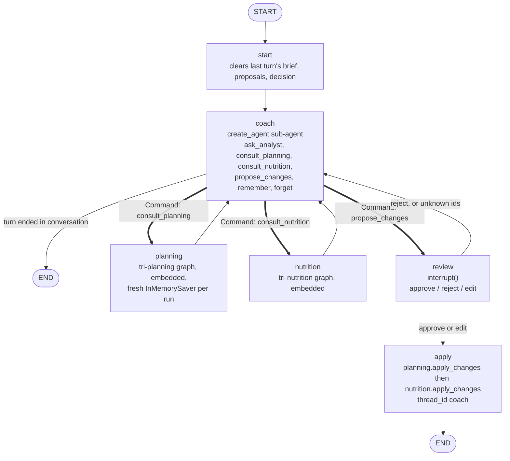

# tri-coach

The agent the athlete talks to. It answers questions by consulting the analyst, decides on its
own authority when the training plan or the nutrition targets should change, briefs the planning
and nutrition agents to produce that change, and presents one change set for approval. Nothing
is written to Garmin or TrainingPeaks until the athlete approves.

## Commands

```
uv run tri-coach chat [--no-live]              # the conversation; /status /memory /pending /tools /prompt /sync /quit
uv run tri-coach memory [--forget ID]          # print the coach's athlete memory, or remove one entry
uv run tri-coach reset [--yes] [--forget-memory]   # clear the coach thread (and optionally its memory)
```

`tri-planning chat`, `tri-planning check-in`, `tri-nutrition chat`, `tri-nutrition check-in`
and `tri-nutrition today` are unchanged; the coach adds a layer and removes nothing.

## The graph

`build_graph(deps, checkpointer, store)` compiles a `StateGraph` over `CoachState` on thread
`coach`. The coach node is a `create_agent` sub-agent rebuilt every turn with a fresh system
prompt: stable rules (persona, decision policy, routing guide, memory policy), then a context
block from the tables and both Store namespaces, then the athlete memory.



Double arrows are `Command(goto=..., graph=Command.PARENT)` returned by a tool inside the
coach sub-agent. Such a command unwinds the sub-agent before its model step is committed, so
each handoff tool re-emits the turn's messages together with its own `ToolMessage`; the
planning or nutrition node then replaces that `ToolMessage`'s content (same id) with the
proposal, and the history reads as one tool call and its result. Because a conditional edge on
`coach` would fire alongside a handoff, `coach` has only a static edge to `END`. A call made
beside a handoff in the same step could never be answered, so the sub-agent's model calls bind
`parallel_tool_calls=False` and any sibling that slips through still gets a "not delivered"
`ToolMessage`: the thread never holds a `tool_use` without its `tool_result`.

| Node | Model call | Reads | Writes | Returns |
|---|---|---|---|---|
| `start` | none | nothing | nothing | clears `brief`, `proposals`, `proposal_request`, `review_decision`, `reports`; keeps `pending` |
| `coach` | sub-agent loop | tables and both Store namespaces (context), coach memory | coach memory (via `remember`/`forget`) | new messages, or a `Command` from a tool |
| `planning` | the embedded planning graph | `brief` | planning's working tables (as a standalone run would before review) | `proposals` + one, the handoff result message |
| `nutrition` | the embedded nutrition graph | `brief` | nutrition's working tables, the profile on intake | same |
| `review` | none | `proposal_request`, `proposals`, the held `pending` | nothing before the interrupt | `pending`, `review_decision`; a reject note as a `HumanMessage` |
| `apply` | none | `pending` | TrainingPeaks and Garmin through the packages' `apply_changes`, their audit rows with `thread_id = "coach"` | `reports`, the remainder in `pending` under `held-planning` / `held-nutrition`, one report message |

Invariants by construction: no write tool is ever bound to a model; the only path into either
package's `apply_changes` is `apply`, reached only from `review`; the embedded graphs contain
no `review` or `apply` node; consultations run in a fresh checkpoint namespace with a private
in-memory saver carrying that package's serde, so a consultation never sees an earlier one.

A partial apply keeps what it could not write in `pending` under the stable ids
`held-planning` and `held-nutrition`. The context block names those ids, and `review` resolves
a `propose_changes` call against this turn's proposals and the held set, so a later turn can
re-propose the remainder by id.

## Memory

Namespace `("athlete", "coach")`, key `memory`, a list of entries `{id, kind, text, created,
until}` with kinds injury, constraint, preference, event, coaching_style, note, checkin. The
whole active list is rendered into the prompt; entries whose `until` has passed are dropped
from the rendering and stay in the Store until forgotten. `reset --forget-memory` deletes the
key. Nutrition's namespace is read for the context block and never written by the coach.

## Sessions

One Garmin process (`GARMIN_ENABLED_TOOLS` set to the union of the analyst's, planning's and
nutrition's lists) and one TrainingPeaks process, opened with
`tri_core.mcp.live_tools.open_live_servers`. The bound tools go to the analyst (its read-only
lists plus nutrition's `read_body_composition`) and to planning's adjust sub-agent; a
`ToolsCaller` per server goes to planning's and nutrition's deps for their read tools and
`apply_changes`.

## Status

- Coach v1 (2026-09): chat, memory, reset; handoffs, review gate, apply dispatch, bought-plan
  adoption. Live test (`tests/test_live.py --live`): not yet run.
- Milestone 3 (check-in, post-apply nutrition regeneration, routing dataset and eval): pending.
