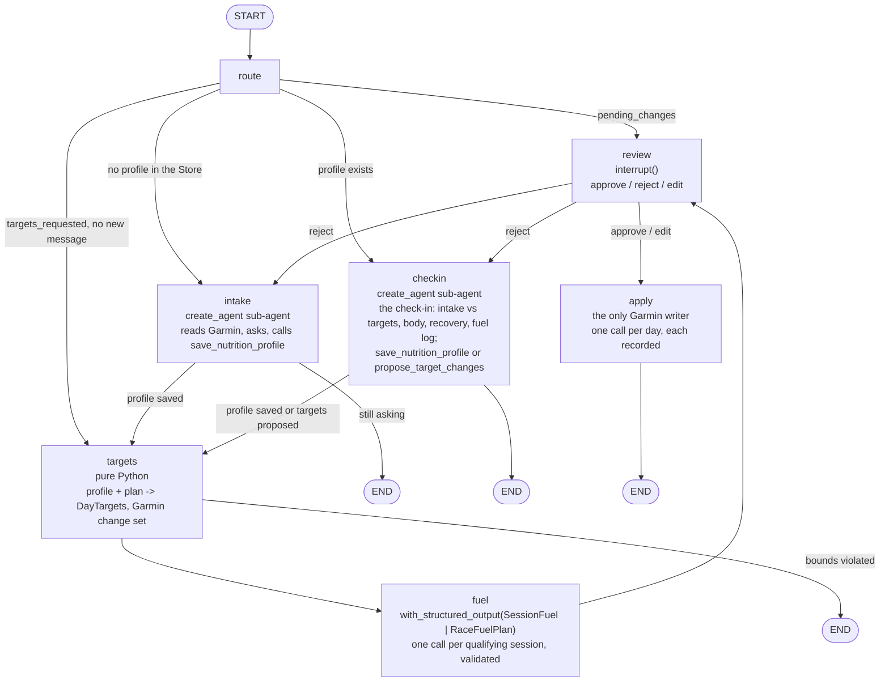

# tri-nutrition

The nutrition agent: interviews the athlete about diet, restrictions and physique goals, derives
periodized daily calorie and macro targets and per-session fueling plans from the training plan,
writes them to Garmin Connect and TrainingPeaks after approval, and checks in against logged
intake and body composition. Design: `docs/superpowers/specs/2026-09-10-tri-nutrition-design.md`.
Plans: `docs/superpowers/plans/2026-09-10-tri-nutrition-0*.md`.

## Layout so far

- `nutrition/models.py`: profile, product, session, day target, session fuel, race plan, change.
- `nutrition/constants.py`: every tunable number (formulas, macro table, deficit sizes, bounds).
- `nutrition/energy.py`: `rmr`, `session_kcal`, `day_type`. Pure.
- `nutrition/targets.py`: `build(profile, sessions, ctx, today, horizon_days)` -> one `DayTarget`
  per day. Pure.
- `nutrition/bounds.py`: `validate_targets`, `validate_fuel`, `validate_race` -> violations. Pure.
- `repo.py`: the three nutrition tables (`migrations/004_nutrition.sql`).
- `evals/`: cases, target, evaluators, runner for the LangSmith evaluation (no database).

Try the targets builder without a database:

```bash
uv run python -c "
from datetime import date, timedelta
from tri_nutrition.nutrition.models import NutritionProfile, PlanContext, Session
from tri_nutrition.nutrition.targets import build
from tri_nutrition.nutrition.bounds import validate_targets
p = NutritionProfile(height_cm=180, weight_kg=80, body_fat_pct=15, sex='m', age=40, goal='lose',
    target_weight_kg=76, pattern='omnivore', meals_per_day=3, cooks=True, tracks_food=True,
    scale_days_per_week=3, unit_preference='metric')
today = date.today()
s = [Session(day=today+timedelta(days=1), sport='bike', duration_min=90, intensity='endurance', planned_tss=80),
     Session(day=today+timedelta(days=3), sport='run', duration_min=50, intensity='threshold'),
     Session(day=today+timedelta(days=5), sport='bike', duration_min=180, intensity='endurance', planned_tss=170)]
ts = build(p, s, PlanContext(source='plan', ftp_watts=250), today, 7)
for t in ts:
    print(t.day, f'{t.day_type:9}', t.session_kcal, t.total_kcal, f'{t.carbs_g}/{t.protein_g}/{t.fat_g}', t.notes)
print(validate_targets(ts, p) or 'within bounds')
"
```

## The graph (Plan 2)

`build_graph(deps, checkpointer, store, *, embedded=False)` compiles a LangGraph `StateGraph`
over `NutritionState` with two kinds of persistence: the checkpointer saves the thread's state
after every node (so a pause at `review` survives the process exiting), and the Store holds the
athlete's profile, fuel log and product library under `("athlete", "nutrition")`, which outlive
any thread.



**Regenerate entry and embedded mode.** Invoking the graph with `{"targets_requested": true,
"regenerate_from": "checkin"}` and no message routes straight to `targets`, which rebuilds the
horizon from the stored plan; the coach uses it after a plan change has been applied.
`build_graph(..., embedded=True)` adds no `review` or `apply`: `fuel` ends the run and so does
a targets violation, leaving `pending_changes` and `pending_summary` for the coach to review;
writes then go through `apply_changes` in `graph/nodes/apply.py` with `thread_id="coach"`.
The check-in prompt treats a message starting with `Head coach brief:` as a bounded instruction
to execute and nothing else. `tri-nutrition today` is unchanged.

The check-in reads through tools only: `read_intake_vs_targets` joins the Garmin food log to
`nutrition_targets` per day (so the model reads deltas, not two lists), `read_body_composition`
and `read_hydration` come from the Index scale and the app, and the SQL tool covers
`daily_metrics` and workout comments. Its commit tools write the Store only:
`record_fuel_feedback` appends to the fuel log (and adds a product after an ok outcome),
`propose_target_changes` validates overrides that the graph applies on top of the profile when it
regenerates targets; approve persists them, reject discards them.

## Commands

- `tri-nutrition chat [--no-live]`: the REPL. `/status`, `/profile`, `/pending`, `/sync`, `/quit`.
  At review: `approve`, `reject <note>`, or `edit` (YAML in `$EDITOR`).
- At review the table is followed by the session fueling lines and the race timeline.
  `set_session_note` writes the workout's private note; `set_race_note` creates or updates the
  calendar note titled `Race fuel: <event> <date>`. A note is only overwritten when the agent
  wrote it (or the workout's private note is empty).
- `tri-nutrition today [--yes] [--no-live]`: the daily write. Regenerates the horizon from the
  stored profile and plan (no model call), stores it, and writes today's target to Garmin after a
  `y/N`. Garmin holds only the current day's goal (a future date is rejected by Garmin), so run
  this each morning; the chat's review only ever proposes today's Garmin write too.
- `tri-nutrition check-in [--yes] [--no-sync] [--no-live]`: runs `tri sync`, sends the fixed
  check-in request on the nutrition thread, prints the report and any proposed change set, and
  exits 3 while it waits at review. `--yes` approves the changes that passed validation; a
  note whose plan still has violations is skipped and printed, and the exit code is 1. A review
  left by an earlier run is shown but never approved here (exit 3): answer it in `chat`.
- `tri-nutrition eval [--judge/--no-judge] [--prefix NAME] [--recreate-dataset]`: creates the
  LangSmith dataset `tri_nutrition_fueling` from `evals/cases.py` when missing, runs the fueling
  prompts over it as experiment `fuel-v<PROMPT_VERSION>`, and prints the pass rate per
  evaluator (`targets_within_bounds`, `fuel_within_bounds`, `fuel_respects_profile`). Bump
  `PROMPT_VERSION` in `prompts/fuel.py` whenever a fueling prompt changes and compare runs in
  LangSmith.
- `tri-nutrition reset [--yes] [--forget-profile]`: clears the thread and unwritten rows; only
  `--forget-profile` deletes the Store keys.

Setup once per database (creates the checkpoint and store tables):

```bash
uv run python scripts/setup_checkpointer.py $DATABASE_URL
uv run python scripts/setup_checkpointer.py $TEST_DATABASE_URL
```
