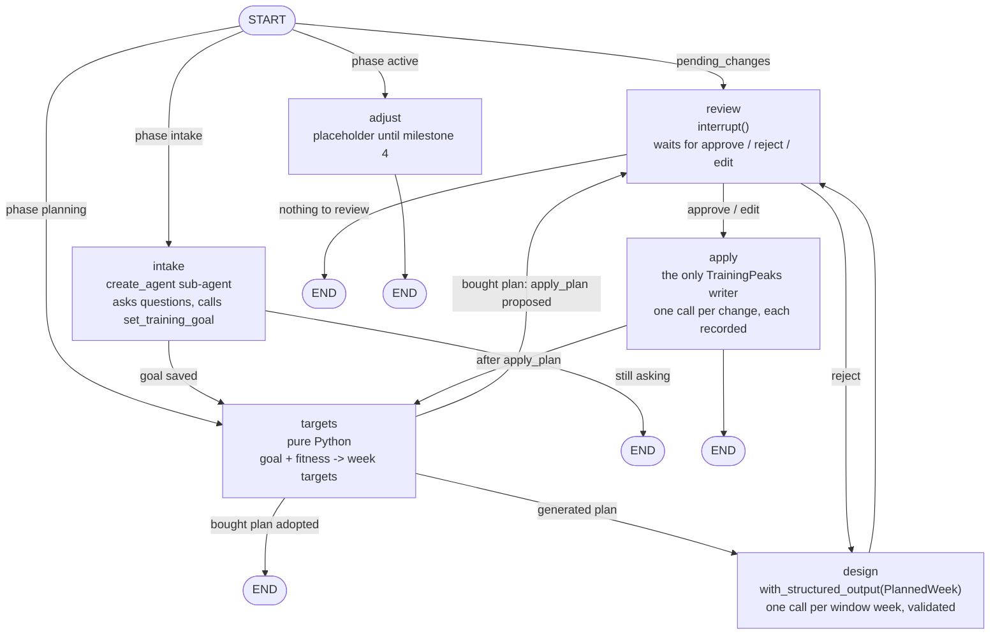

# tri-planning

The planning agent: establishes a training goal, builds a periodized plan, writes sessions to
the TrainingPeaks calendar after approval, and adjusts the plan as training unfolds.
Design: `docs/superpowers/specs/2026-09-07-tri-planning-design.md`. Plans:
`docs/superpowers/plans/2026-09-07-tri-planning-0*.md`.

## The graph

`build_graph(deps, checkpointer)` compiles a LangGraph `StateGraph` over `PlanningState`. Each
node is a function that takes the state and returns a partial update; LangGraph merges the
update in (`messages` appends, every other key is replaced) and a route function picks the next
node from the new state. The checkpointer saves the state after every node, so a pause at
`review` survives the process exiting.



| Node | Model call | Writes | Reads | Returns |
|---|---|---|---|---|
| `intake` | sub-agent loop with `query_training_db`, `list_tp_training_plans`, `set_training_goal` | `training_goals` (via the tool) | messages | new messages; `goal_id` and `phase: planning` once the goal is saved |
| `targets` | none | `training_plans`, `plan_weeks` | goal, `daily_metrics` | `plan_id` and a summary message, or `pending_changes` for a bought plan |
| `design` | one structured-output call per week in the horizon, plus one retry per week when the validator objects | `plan_weeks.designed` | goal, plan, thresholds | `pending_changes` (one `create` per session), `pending_summary` |
| `review` | none | nothing before the interrupt | `pending_changes` | `review_decision`; a reject note as a `HumanMessage`; edited changes on edit |
| `apply` | none | TrainingPeaks, `plan_changes`, `plan_weeks.written_to_tp` | `plan_changes` (ownership) | remaining changes, `last_error`, report message, `phase: active` when clean |
| `adjust` | none yet | nothing | nothing | a placeholder message |

Two invariants hold by construction: no TrainingPeaks write tool is ever bound to a model, and
there is no edge into `apply` except from `review`.

## Layout so far

- `planning/models.py`: goal, week target, session, week, calendar change.
- `planning/periodization.py`: every tunable number (phase table, ramp, recovery, taper, IF).
- `planning/targets.py`: `build(goal, fitness, start)` -> week targets. Pure.
- `planning/validate.py`: `week(planned, target, goal)` -> violations. Pure.
- `repo.py`: the four planning tables (`migrations/002_planning.sql`).
- `planning/tp_calls.py`: `CalendarChange` -> TrainingPeaks tool name and arguments. Pure.
- `graph/`: `state.py`, `deps.py`, `llm.py`, `nodes/` (one file per node), `graph.py` (wiring, Task 7).
- `tools/goal.py`, `prompts/`: what the intake and design nodes give the model.
- `testing.py`: `FakeTp`, `NoCommit`, canned goal and week payloads for tests.

Try the targets without a database:

```bash
uv run python -c "
from datetime import date
from tri_planning.planning.models import TrainingGoal, FitnessSnapshot
from tri_planning.planning.targets import build, next_monday
g = TrainingGoal(goal_type='olympic', event_date=date(2026,12,13), weekly_hours_min=6,
                 weekly_hours_max=10, available_days={d:'any' for d in ('mon','tue','wed','thu','fri','sat','sun')})
for w in build(g, FitnessSnapshot(ctl=45), next_monday(date.today())):
    print(w.week_start, w.phase, w.target_tss, w.target_hours, 'R' if w.is_recovery else '', w.flags)
"
```
