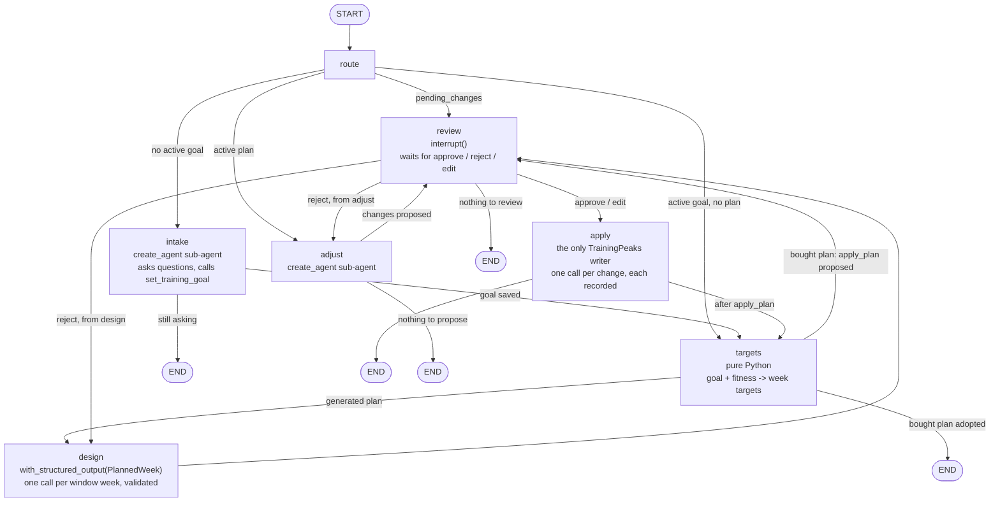

# tri-planning

The planning agent: establishes a training goal, builds a periodized plan, writes sessions to
the TrainingPeaks calendar after approval, and adjusts the plan as training unfolds.
Design: `docs/superpowers/specs/2026-09-07-tri-planning-design.md`. Plans:
`docs/superpowers/plans/2026-09-07-tri-planning-0*.md`.

## The graph

`build_graph(deps, checkpointer, *, embedded=False)` compiles a LangGraph `StateGraph` over
`PlanningState`. Each node is a function that takes the state and returns a partial update;
LangGraph merges the update in (`messages` appends, every other key is replaced) and a route
function picks the next node from the new state. The checkpointer saves the state after every
node, so a pause at `review` survives the process exiting.



| Node | Model call | Writes | Reads | Returns |
|---|---|---|---|---|
| `route` | none | nothing | `training_goals`, `training_plans` | `phase`, `goal_id`, `plan_id` derived from the tables every run (a fresh thread and a stateless consultation start where the database says) |
| `intake` | sub-agent loop with `query_training_db`, `list_tp_training_plans`, `set_training_goal` | `training_goals` (via the tool) | messages | new messages; `goal_id` and `phase: planning` once the goal is saved |
| `targets` | none | `training_plans`, `plan_weeks` | goal, `daily_metrics` | `plan_id` and a summary message, or `pending_changes` for a bought plan |
| `design` | one structured-output call per week in the horizon, plus one retry per week when the validator objects | `plan_weeks.designed` | goal, plan, thresholds | `pending_changes` (one `create` per session), `pending_summary` |
| `review` | none | nothing before the interrupt | `pending_changes` | `review_decision`; a reject note as a `HumanMessage`; edited changes on edit |
| `apply` | none | TrainingPeaks, `plan_changes`, `plan_weeks.written_to_tp` | `plan_changes` (ownership) | remaining changes, `last_error`, report message, `phase: active` when clean |
| `adjust` | sub-agent loop with `query_training_db`, `get_training_readiness`, `get_hrv_data`, `tp_get_workouts`, `design_next_week`, `propose_calendar_changes` | `plan_weeks.designed` (when `design_next_week` runs) | this/next week targets, last 7 days planned vs actual, 3-day readiness/HRV vs 30-day baseline, TSB, owned workouts | new messages; `pending_changes`/`pending_summary`/`changes_from: adjust` when changes are proposed, cleared otherwise |

Two invariants hold by construction: no TrainingPeaks write tool is ever bound to a model, and
there is no edge into `apply` except from `review`.

**Embedded mode.** `build_graph(..., embedded=True)` adds no `review` or `apply` node and sends
every edge that would reach `review` to `END`, so the run ends with `pending_changes`,
`pending_summary` and `changes_from` in the output state. The coach (`tri-coach`) runs the
graph this way, reviews the proposal itself, and writes through `apply_changes` in
`graph/nodes/apply.py` with `thread_id="coach"`. The adjust prompt treats a message starting
with `Head coach brief:` as a bounded instruction to satisfy and nothing else; the review
checklist is for `tri-planning check-in` and the athlete's own messages.

## Commands

```bash
uv run tri-planning chat [--no-live]   # intake -> targets -> design -> review -> apply
uv run tri-planning reset [--yes]      # abandon goal and plan, clear the thread; TrainingPeaks untouched
uv run tri-planning check-in [--yes] [--no-sync] [--no-live]   # sync, review last 7 days, propose; exit 3 when paused, 1 on a model error
uv run python scripts/design_eval.py --prompt-version v1         # LangSmith pass rate for the design prompt
```

In chat: `/status` (goal, phase, this week's target vs actual, weeks on the calendar), `/pending`
(re-show a paused change set), `/sync`, `/quit`. At review: `approve`, `reject <note>`, or
`edit` (opens the change set as YAML in `$EDITOR`).

One-time setup after the migrations: `uv run python scripts/setup_checkpointer.py <DATABASE_URL>`
for both databases (creates LangGraph's checkpoint tables).

## Adjusting

Once the plan is active every chat turn goes to the adjust sub-agent, which sees this week's and
next week's targets, the last 7 days planned versus actual (RPE >= 8 and feeling <= 3 flagged),
3-day readiness and HRV against a 30-day baseline, TSB, and the list of agent-authored workouts.
It may call `get_training_readiness`, `get_hrv_data`, `tp_get_workouts`, `query_training_db`,
`design_next_week` (when fewer than two designed weeks remain) and finally
`propose_calendar_changes`. Every proposal goes through the same review and apply as the first plan.
`check-in` runs the same review with a fixed prompt; exit code 3 means it is waiting for you.
Exit code 1 means the model call failed; nothing was changed.
For a cron job: `uv run tri-planning check-in --yes` applies without asking; leave `--yes` off
to review in the next `chat`.

## How a turn flows

```
you> ...            intake sub-agent (create_agent) asks, queries the DB, finally calls set_training_goal
[targets] ...       pure Python: goal + fitness -> week targets (training_plans, plan_weeks)
[design]            one with_structured_output(PlannedWeek) call per window week, validated, retried once
<change table>      review node: interrupt(); the run is checkpointed in Postgres until you answer
approve             apply: one TrainingPeaks call per change, each recorded in plan_changes
```

## Layout

- `graph/`: `state.py` (PlanningState), `deps.py` (GraphDeps), `llm.py` (model, sub-agent
  factory), `nodes/` (one file per node), `graph.py` (wiring and route functions),
  `checkpointer.py` (AsyncPostgresSaver).
- `planning/`: `models.py`, `periodization.py` (every tunable number), `targets.py` (goal +
  fitness -> week targets, pure), `validate.py` (week rules, pure), `tp_calls.py`
  (`CalendarChange` -> TrainingPeaks tool call, pure).
- `tools/goal.py`, `prompts/`: what the intake and design nodes give the model.
- `repl.py`: terminal I/O, event rendering, the review dialogue, YAML edit round trip.
- `repo.py`: the four planning tables (`migrations/002_planning.sql`, `003_*.sql`).
- `testing.py`: `FakeTp`, `NoCommit`, canned goal and week payloads for tests.

Try the targets without a database:

```bash
uv run python -c "
from datetime import date
from tri_planning.planning.models import TrainingGoal, FitnessSnapshot
from tri_planning.planning.targets import build, next_monday
g = TrainingGoal(goal_type='olympic', event_date=date(2026,12,13), weekly_hours_min=6,
                 weekly_hours_max=10, available_days={d:'any' for d in ('mon','tue','wed','thu','fri','sat','sun')})
for w in build(g, FitnessSnapshot(ctl=45), next_monday(date.today())):
    print(w.week_start, w.phase, w.target_tss, w.target_hours, 'R' if w.is_recovery else '', w.flags)
"
```
